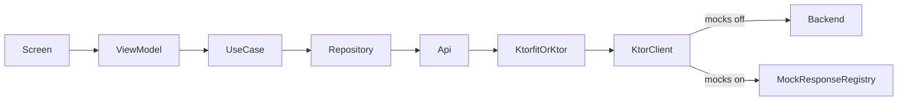

# Backend, Mocks And Testing Plan

## Цель

Спроектировать backend-слой Android-приложения так, чтобы до готовности сервера feature-модули работали через те же Retrofit-контракты, но ответы могли подменяться mock-движком в debug и UI-тестах.

## Ключевое Решение

Первым шагом переводим архитектурный фундамент в KMP-ready направление. Общие domain/data/network/mock-контракты должны проектироваться так, чтобы позже переиспользоваться на Android, iOS и других клиентах. AR-слой остается platform-specific.

Не заводим два отдельных HTTP-клиента для real/mock. Оставляем один сетевой pipeline, но не одну "общую апишку приложения". `Api`-интерфейсов будет много: общие живут в shared business modules, feature-specific API живут внутри feature-модулей. Выбор real/mock делается ниже, на уровне network pipeline.

Так feature-слои всегда идут по одному пути:



`CatalogRepository`, `LayoutRepository`, use case и ViewModel не должны знать, что сейчас включены моки.

## Первый Шаг: KMP Foundation

Перед реализацией backend/mock слоя нужно заложить KMP-ready основу:

- определить KMP-модули для общих слоев: `:network:core`, `:shared:tiles`, `:mock:core`, `:mock:tiles` — выполнено первым шагом;
- использовать `commonMain` для моделей, DTO, repository interfaces, use cases, mappers и mock contracts — выполнено для базового tile/mock/network контура;
- Android target включен сразу, iOS targets (`iosX64`, `iosArm64`, `iosSimulatorArm64`) подключаются на macOS, чтобы Windows-сборка Android не ломалась из-за iOS toolchain;
- добавлены `:shared:app`, `:shared:ar:contracts` и `:iosApp` для общего CMP shell, AR contracts и iOS entry point;
- выбрать сетевой стек, совместимый с KMP: предпочтительно Ktorfit поверх Ktor Client или чистый Ktor Client;
- не использовать Android-only зависимости в common-коде;
- оставить ARCore/SceneView, Android permissions и Android-specific UI в Android source set / Android feature layer;
- подготовить зависимости так, чтобы будущие iOS/Quest клиенты могли использовать общий domain/data/network код без переписывания контрактов.

Важно: KMP Foundation не означает урезанный iOS-клиент. iOS должен реализовывать тот же продуктовый функционал, который есть на Android: каталог, выбор плитки, AR-выделение пола, точки/линии/замыкание контура, undo/reset/OK, текстура в полигоне, поворот текстуры, backend-запросы и debug/mock mode.

Общий пользовательский flow должен жить в `:shared:app`: каталог, переходы, внешний navigation shell, transition screen и bottom bar. Android и iOS entry points не должны иметь разные корневые UI-сценарии; они только передают свой platform-specific AR content в общий AR slot.

Различаться должен не сценарий, а platform-specific слой:

- Android: ARCore + SceneView;
- iOS: ARKit + platform rendering/interop через `ARSCNView` в Compose `UIKitView`;
- Quest: отдельная MR/AR реализация под доступный SDK.

Общие KMP-контракты должны описывать состояние, use cases, модели, сетевые запросы, геометрию и нормализацию точек так, чтобы каждая платформа реализовывала одинаковое поведение через свой AR/rendering слой.

## Новая Модульная Схема

Добавить отдельные верхнеуровневые технические модули и shared business module для плитки:

- `:network:core` — KMP-ready сетевой фундамент: Ktor Client/Ktorfit factory, базовый URL, JSON, common error handling, `ApiResult`, network qualifiers. Не содержит бизнес endpoint'ов.
- `:shared:tiles` — общий модуль плитки: domain-модели, `TilesRepository`, `GetTilesUseCase`, `TilesApi`, DTO, data source, repository implementation.
- `:mock:core` — mock engine для debug/dev: `MockResponseRegistry`, `MockNetworkInterceptor`, core DSL, `JsonAsset`.
- `:mock:tiles` — mock routes/assets для плитки: `get.tiles.all`, `JsonAsset.tiles.all`.
- `:testing:core` — тестовые правила/DSL для UI-тестов: условный `Application { api { get.tiles.all reply JsonAsset.tiles.all } }`.

Зависимости:

- Feature-модули зависят от `:network:core` только если им нужен свой feature-specific API.
- Feature-модули зависят от `:shared:tiles`, если используют общий tile-контур.
- `:app` подключает `:mock:core` и `:mock:tiles` только в `debugImplementation`.
- UI-тесты подключают `:testing:core`, `:mock:core` и нужные domain mock-модули через `androidTestImplementation`.
- Release-сборка не содержит debug-переключатель и mock registry.

Правило выноса:

- Если API/модель/use case нужны нескольким фичам, создается shared business module, например `:shared:tiles`.
- Если API нужен только одной фиче, весь контур `Api -> DataSource -> Repository -> UseCase` остается внутри feature-модуля.
- `:network:core` не знает про плитки, проекты, заборы, расчет раскладки и любые будущие бизнес-области.

## Runtime Mock Toggle

В debug-версии добавить настройку в top bar/settings:

- по умолчанию `mocksEnabled = true`;
- toggle хранится в debug-only `MockSettingsRepository`, можно через DataStore/SharedPreferences;
- `MockNetworkInterceptor` при каждом запросе смотрит текущее значение;
- если mocks enabled и для запроса есть registered mock response, возвращает JSON из assets;
- если mocks disabled, делает `chain.proceed(request)` на реальный backend.

Итого сетевой pipeline остается один, API-интерфейсы остаются одни, переключение происходит без пересоздания feature-логики.

## Shared Tiles And Catalog Feature

Для каталога общий tile-контур лучше вынести в `:shared:tiles`, потому что список плитки понадобится не только экрану каталога, но и выбору плитки/AR-сценариям:

- `shared/tiles/domain/model` — `TileCollection`, `TileTexture`, `TileVariant`.
- `shared/tiles/domain/repository` — `TilesRepository`.
- `shared/tiles/domain/usecase` — `GetTilesUseCase`.
- `shared/tiles/data/remote` — `TilesApi`, DTO, `TilesRemoteDataSource`.
- `shared/tiles/data/repository` — `TilesRepositoryImpl`.
- `features/catalog/presentation` — `CatalogViewModel`, UI state, screen/components.

Контракт из `BACKEND_ROADMAP.md` можно взять как первый mock/API contract: `GET /api/v1/tile-collections`.

Структура ответа каталога должна учитывать, что цена и доступность могут отличаться на уровне конкретного размера плитки и конкретной текстуры:

- `id` для backend/database сущностей используем числовой; строковый человекочитаемый идентификатор хранится отдельно как `slug` или `code`;
- коллекция хранит общую информацию: `id`, `name`, `description`, `category`, `manufacturer`, `previewImageUrl`;
- `textures` хранят визуальные варианты и ссылки на изображения/текстуры;
- `tileVariants` хранят размеры (`widthMm`, `lengthMm`, `thicknessMm`), цену и складской статус конкретного размера;
- `patterns` предварительно описывают узоры/схемы раскладки и могут ссылаться на несколько `tileVariant` через `variantIds`;
- `textures` используют `repeatPattern`, потому что физический размер повторяемого изображения-паттерна не равен обязательно размеру одного варианта плитки;
- если у текстуры есть статус, он должен быть явным (`active`, `hidden`, `discontinued`), а не общим `isAvailable`;
- collection-level availability пока не вводим, чтобы не смешивать доступность коллекции, текстуры и размера.

Для mock assets использовать extension-style API:

```kotlin
object JsonAsset

val JsonAsset.tiles: TileAssets = TileAssets

object TileAssets {
    val all = "mock/tiles/all.json"
}
```

А routes DSL должен повторять бизнес-вложенность запросов:

```kotlin
Application {
    api {
        get.tiles.all reply JsonAsset.tiles.all
    }
}
```

Mock assets для плитки должны жить в `:mock:tiles`, а не в feature-модуле AR:

```text
mock/tiles/src/main/assets/mock/tiles/
  catalog/all.json
  textures/paving_stones_v1.png
  textures/paving_stones_v2.png
  previews/paving_stones_v1_preview.png
```

На бою API возвращает `https://...` URL. В mock JSON можно возвращать `file:///android_asset/mock/tiles/...`, чтобы UI и AR-слой работали через те же DTO/domain поля, но читали локальные assets. Текущие текстуры из `features/floor-detection/src/main/assets` нужно перенести или продублировать в `:mock:tiles` для debug/mock сценариев. Если релизу еще нужен локальный fallback, его лучше хранить отдельно как production fallback asset, а не смешивать с mock data.

## Layout Calculation Feature

Для расчета после `OK` лучше не смешивать с AR-детекцией. Внутри `:features:floor-detection` можно добавить отдельный backend-контур:

- `LayoutRepository` / `CalculateLayoutUseCase`;
- DTO для `POST /api/v1/layout/calculate`;
- mapper AR polygon `x/z -> backend x/y`;
- UI состояния `Calculating`, `CalculationSuccess`, `CalculationError`.

ARCore-часть остается локальной, backend получает только нормализованный 2D-полигон, выбранную плитку и угол.

## UI Tests

UI-тесты держим не в mock-модуле, а рядом с владельцем сценария:

- screen-level тесты feature-модуля — в `features/<feature>/src/androidTest`;
- end-to-end/navigation сценарии приложения — в `app/src/androidTest`;
- общие test fixtures/DSL/json assets — в `:testing:core`.

Так тесты остаются около фичи, но mock-инфраструктура переиспользуется.

## Документация

Обновить:

- `docs/ARCHITECTURE.md` — правило: domain зависит от interfaces, data реализует repositories, network скрыт за repository.
- `docs/MODULARIZATION.md` — правила для `:network:*`, shared business modules вроде `:shared:tiles`, `:mock:*`, `:testing:*`.
- `docs/TESTING.md` — правила mock API для UI-тестов.
- Создать `docs/BACKEND_ANDROID_INTEGRATION.md` — схема Retrofit, mock interceptor, debug toggle, contracts.

## Что Не Делать

- Не делать отдельные repository/use case для моков.
- Не прокидывать `isMockEnabled` во ViewModel/use case.
- Не делать feature-модули зависимыми от mock-модуля.
- Не хранить UI-тесты в mock-модуле: mock-модуль должен помогать тестам, но не владеть сценариями фич.
- Не использовать разные API-интерфейсы для mock и real: контракт должен быть один.
- Не складывать все backend endpoint'ы в один общий network module.
- Не выносить feature-specific API в shared без реального переиспользования.
