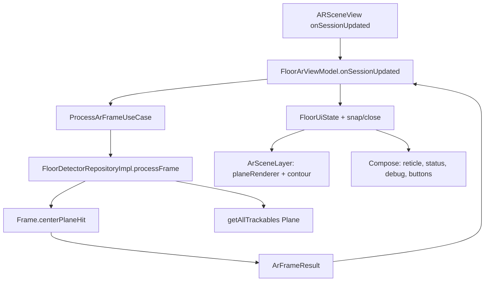
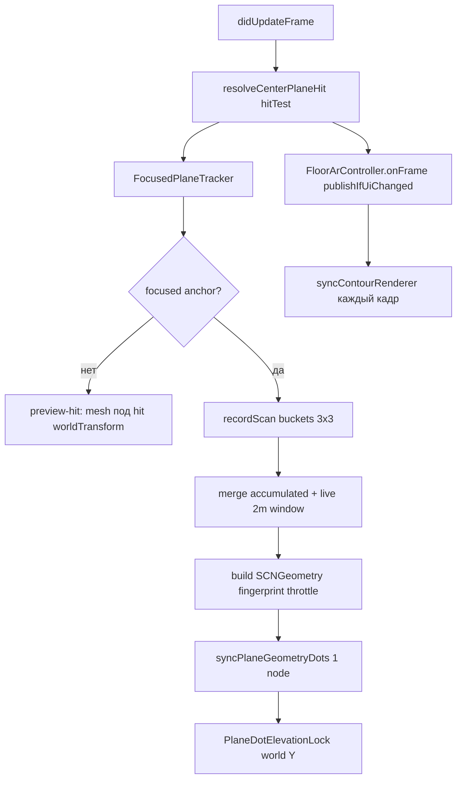

# Обнаружение горизонтальных поверхностей (Android и iOS)

Документ описывает, как приложение **AR Plitka** находит пол и другие горизонтальные поверхности, как отображает их пользователю и чем отличаются реализации на Android (ARCore) и iOS (ARKit).

**Для агентов и разработчиков:**

- **Android** — [статус и договорённости](#android--статус-и-договорённости): эталон поиска пола и **полный** flow контура/плитки.
- **iOS** — [статус и договорённости](#ios--статус-и-договорённости): поиск поверхности **зафиксирован**; дальше — паритет контура с Android, без тюнинга белых точек без запроса.

## Цель UX

Пользователь ходит по комнате с камерой и видит **белые круглые точки в 3D на поверхности** — preview будущей разметки контура. Поверхность должна:

- обнаруживаться **динамически** при движении;
- быть **горизонтальной** (пол, стол, кровать сверху);
- **фокусироваться** на той плоскости, куда направлен прицел (center reticle);
- давать понятный статус: «ищем», «найдено», площадь, center hit.

---

## Общие понятия

| Понятие | Описание |
|--------|----------|
| **Horizontal plane** | Горизонтальная плоскость, которую строит AR-движок (пол, стол и т.д.) |
| **Center reticle** | Перекрестие в центре экрана; по нему определяется «активная» поверхность |
| **Center hit** | Попадание луча из центра экрана в отслеживаемую горизонтальную плоскость |
| **Selected / focused plane** | Плоскость под прицелом — по ней считается площадь и статус «обнаружено» |
| **MIN_FLOOR_AREA_M2** | Минимальная площадь **0.15 m²**, чтобы считать поверхность пригодной |

Общий UI-kit (`shared/ui/kit`): `CenterReticle`, `StatusPanel`, `DebugPanel` — используется на обеих платформах.

### Phase-derived visibility (shared + Android)

Условия «что рисовать на каком этапе» — **computed properties** в state, не размазаны по UI:

| Флаг | Android `FloorUiState` | iOS `FloorContourUiState` |
|------|------------------------|---------------------------|
| Белые точки / plane | `showPlaneRenderer` | `showPlaneDots` / `showPlaneRenderer` |
| Зелёные точки | `showContourPoints` | `showContourPoints` |
| Синие линии | `showContourLines` | `showContourLines` |
| Preview-линия | `showPreviewLine` | `showPreviewLine` |
| Заливка секции | `showSectionFill` | `showSectionFill` |
| Плитка (будущее) | `isTileVisible` | `isTileVisible` (пока false на iOS) |

Правило: **белые точки видны до finalize контура** (`!isContourConfirmed` / `!isFinalized`). После OK белые точки скрываются, остаётся разметка.

---

## Android — статус и договорённости

### Статус (зафиксировано, июнь 2026)

| Решение | Суть |
|---------|------|
| **Эталон продукта** | Android — **референс** по UX поиска пола и по полному циклу разметки (точки → контур → OK → заливка → плитка). iOS подтягивается к этому поведению, а не наоборот. |
| **Поиск поверхности не «лочим»** | Нет фиксации одной рабочей плоскости: пользователь **постоянно** видит обновление горизонтальных plane и может перевести прицел на другую поверхность. Явное требование продукта (отказ от `FloorLocked`). |
| **Визуализация пола — нативная** | Белые точки/сетка плоскостей рисует **`planeRenderer` SceneView/ARCore**, не кастомная mesh-сетка как на iOS. |
| **Логика «где можно ставить точку»** | Только plane **под прицелом** с `isPoseInPolygon` и `area >= 0.15 m²` — это отдельно от «всех видимых» planes renderer. |
| **Не тюним detection без запроса** | Не менять `centerPlaneHit`, порог площади, `planeRenderer` toggle, конфиг ARCore без явной задачи — риск регрессии эталона. |
| **Контур на Android — готов** | Зелёные точки, синие линии, preview, snap/close, OK → confirm → tile — в `FloorArViewModel` + `ArSceneLayer`. |

### Что сделано (поиск + отображение поверхности)

- **ARCore** horizontal plane finding, `LATEST_CAMERA_IMAGE`.
- **Depth** `AUTOMATIC`, если устройство поддерживает.
- **Center hit** из центра viewport: `Frame.hitTest` + фильтр `HORIZONTAL_UPWARD_FACING` + **`Plane.isPoseInPolygon(hitPose)`** (граница полигона ARCore).
- **`selectedPlane`** только под прицелом; площадь `extentX × extentZ`.
- **`showPlaneRenderer`** = `!isContourConfirmed` — белые точки ARCore скрываются после подтверждения контура.
- **Clean Architecture**: `FloorDetectorRepositoryImpl` → `ArFrameResult` (данные), `FloorArViewModel` → `FloorUiState` (UI).
- **Debug-панель** только в debug-сборке (`isDebugBuild()`).

### Что сделано (контур и плитка — эталон для iOS)

| Этап | Поведение |
|------|-----------|
| Прицел | `CenterReticle` активен при `hasCenterHit && !isContourConfirmed` |
| «+» | Точка в `currentHitResult`, anchor на hit pose |
| Линии | Между точками; preview к прицелу |
| Snap / close | Snap 0.05 m; замыкание к первой 0.10 m (≥3 точек) |
| OK (замкнут) | `confirmContour()` → синяя заливка, plane renderer off |
| Плитка | Toggle, смена типа, поворот 0°/45°/90°/135° |
| Стабильность Y | Контур/линии/заливка на **Y первой точки** (`sectionFloorY`), чтобы точки не «плыли» при drift anchor |

### Что сознательно не делаем на Android

| Тема | Причина |
|------|---------|
| **Focused-only белые точки** как на iOS | На Android делегируем визуализацию ARCore; отдельная mesh-сетка не нужна. |
| **Ограничение dots радиусом 2 m** | Нет в Android path; ограничение границ — полигон ARCore + выбор center plane. |
| **«Комната как модель»** | ARCore не знает плинтусы; точки renderer могут уходить за стену, пока plane не разделился. |
| **Фиксация пола после первого detect** | Отменено по продукту. |

### Ограничения среды

- **Тени и тёмные углы** — качество tracking зависит от устройства (обсуждалось на Poco F5); depth и HDR помогают, но не гарантируют.
- **Несколько horizontal planes** (пол + стол) — renderer показывает **все**, может быть шумно; бизнес-логика всё равно по center hit.
- **Плинтус / стена** — hit и визуализация могут выходить за реальную комнату, пока ARCore не уточнит границу plane.

### Критерии «не ломать» при правках

1. `planeRenderer` включён, пока контур **не** подтверждён (`showPlaneRenderer`).
2. Center hit только внутри **polygon** plane под прицелом.
3. `isFloorDetected` только при `selectedArea >= 0.15 m²`.
4. Нет возврата **lock** одной плоскости на весь сеанс.
5. После `confirmContour` — заливка, plane dots скрыты, контурные anchors остаются.
6. Точки контура не уезжают по Y относительно первой точки при обычном drift (проверка `sectionFloorY`).

---

## Android (ARCore) — реализация

### Стек

| Компонент | Путь |
|-----------|------|
| Feature-модуль | `features/floor-detection` |
| AR-сцена | `presentation/components/ArSceneLayer.kt` |
| Детекция кадра | `data/repository/FloorDetectorRepositoryImpl.kt` |
| Hit-test | `shared/ar/core/ArExtensions.kt` |
| UI state | `presentation/viewmodel/FloorArViewModel.kt` |
| Экран | `presentation/screen/FloorArScreen.kt` |

### Конфигурация AR-сессии

`ArSceneLayer.kt`:

```kotlin
config.planeFindingMode = Config.PlaneFindingMode.HORIZONTAL
config.lightEstimationMode = Config.LightEstimationMode.ENVIRONMENTAL_HDR
config.depthMode = Config.DepthMode.AUTOMATIC  // если supportsSceneReconstruction / depth supported
config.focusMode = Config.FocusMode.AUTO
config.updateMode = Config.UpdateMode.LATEST_CAMERA_IMAGE
planeRenderer = uiState.showPlaneRenderer  // !isContourConfirmed
```

### Поток данных (каждый кадр)



### Center hit

`ArExtensions.kt`:

```kotlin
fun Frame.centerPlaneHit(viewportSize: IntSize): HitResult? {
    val hits = hitTest(viewportSize.width / 2f, viewportSize.height / 2f)
    // первый Plane: HORIZONTAL_UPWARD_FACING, TRACKING, isPoseInPolygon(hitPose)
}
```

### «Поверхность обнаружена»

`FloorDetectorRepositoryImpl.kt`:

```kotlin
val selectedPlane = (centerHit?.trackable as? Plane)?.takeIf {
    it.isUsableHorizontalPlane() && it.area() >= MIN_FLOOR_AREA_M2  // 0.15f
}
isFloorDetected = selectedPlane != null
hasCenterHit = centerHit != null
selectedArea = selectedPlane?.area() ?: max horizontal plane area
```

### UI-состояния (detection)

| Условие | `status` | `instruction` |
|---------|----------|---------------|
| `trackingState != TRACKING` | `TRACKING_LOST` | `MOVE_PHONE` |
| TRACKING, нет floor | `SEARCHING_FLOOR` | `SEARCHING` |
| TRACKING, floor найден | `FLOOR_DETECTED` / `POLYGON_CLOSED` | `DETECTED` / … |

### Phase flags (`FloorUiState`)

| Флаг | Условие |
|------|---------|
| `showPlaneRenderer` | `!isContourConfirmed` |
| `showContourPoints` | `points.isNotEmpty() && !isContourConfirmed` |
| `showContourLines` | `points.size >= 2 && !isTileVisible` |
| `showPreviewLine` | есть точки, не closed, есть `currentHitPose` |
| `showSectionFill` | confirmed + closed + ≥3 точек |

### Debug (только debug build)

Planes, Area, Tracking, Points, Closed, Confirmed, Tile, Texture rotation — `FloorArScreen.kt`.

### Ключевые файлы

| Файл | Роль |
|------|------|
| `ArSceneLayer.kt` | ARSession, planeRenderer, contour/fill/tile 3D |
| `FloorDetectorRepositoryImpl.kt` | Кадр → `ArFrameResult`, без UiState |
| `ArExtensions.kt` | `centerPlaneHit`, `area()`, `isUsableHorizontalPlane` |
| `ProcessArFrameUseCase.kt` | Use case обёртка |
| `FloorArViewModel.kt` | UiState, точки, confirm, tile |
| `FloorArScreen.kt` | Compose, debug, кнопки |
| `FloorArRenderConfig.kt` | Размеры точек/линий/заливки |
| `FloorModels.kt` | `FloorUiState`, derived visibility |

---

## iOS — статус и договорённости

### Статус (зафиксировано, июнь 2026)

| Решение | Суть |
|---------|------|
| **Оставляем текущую реализацию** | После оптимизаций (план `ios-plane-speed`) субъективно **не стало сильно лучше**, но **и не хуже** — приемлемый baseline. |
| **Не тюним дальше без запроса** | Не углубляться в белые точки, радиус, drift, mesh, пока не закончен этап **зелёных точек контура**. |
| **Следующий этап** | Постановка зелёных точек, синие отрезки, замыкание контура, OK — заготовка уже в коде (`FloorArController`, `IosArContourRenderer`). |
| **Паритет с Android** | Android — **эталон** UX; iOS по скорости визуально слабее, baseline принят. Контур на iOS — в работе. |

### Что сделано на iOS (план ios-plane-speed)

- Один **mesh** белых точек (`SCNGeometry`), не сотни `SCNNode`.
- **Accumulate + live**: след от ходьбы (buckets) + живое окно **2 m** вокруг прицела в одном mesh.
- **Preview** по `hitTest` (estimated plane) до confirmed anchor.
- **Throttle** пересборки mesh (~12.5 Hz), fingerprint/cache.
- **Debug-метрики**: FPS, dot/node count, gen/sync ms, preview/anchor latency, AR features, hit path.
- **LiDAR** (опционально): `sceneReconstruction = mesh` на поддерживаемых устройствах.
- **Compose**: `FloorArController.publishIfUiChanged()` — UI не на каждый AR-кадр.
- **Высота точек**: `PlaneDotElevationLock` — минимальный зафиксированный world Y, компенсация подъёма plane anchor при уточнении ARKit.

### Что отложено

| Тема | Причина |
|------|---------|
| **`ARRaycast` / `session.raycast`** | В текущих **Kotlin/Native ARKit bindings** нет `ARRaycastResult`, `ARRaycastQueryTarget*`, `raycastQuery`. Используем **`hitTest`**. Добавление — через ObjC bridge, когда понадобится. |
| **Заметный визуальный паритет с Android** | Не достигнут; пользователь не видит «большого улучшения». |
| **Синяя заливка, плитка, rotate** | Только Android; iOS — после контура. |

### Ограничения среды (комната)

- ARKit **поднимает** horizontal plane при уточнении — точки могут казаться «плывущими вверх»; частично гасится `PlaneDotElevationLock`.
- В **комнате** (тени, плинтусы, мебель) хуже, чем на открытом участке пола — это норма для AR, не только баг приложения.
- Точки могут уходить **за стену**, если ARKit продлил plane; смягчается polygon boundary + радиус 2 m.

### Критерии «не ломать» при будущих правках

1. `node count` в debug ≈ **1** на focused plane (один mesh).
2. Preview (`preview-hit`) появляется до polygon anchor.
3. При ходьбе остаётся **след** (accumulate) + **пятно под прицелом** (live 2 m).
4. `showPlaneDots` / белые точки **скрыты после finalize**.
5. Сборка: `./gradlew :iosApp:linkDebugFrameworkIosArm64` на Mac.

---

## iOS (ARKit) — реализация

### Стек

| Компонент | Путь |
|-----------|------|
| Экран + сессия | `iosApp/.../IosArScreen.ios.kt` |
| Белые точки, buckets, mesh | `iosApp/.../IosArPlaneRenderer.kt` |
| Center hit | `iosApp/.../IosArCenterRaycast.kt` |
| AR-конфиг (LiDAR) | `iosApp/.../IosArSessionConfiguration.kt` |
| Геометрия точек (ObjC) | `PlaneGeometryBridge.h`, `plane_geometry_bridge.def` |
| Контур (зелёный) | `IosArContourRenderer.kt`, `IosFloorAnchorStore.kt` |
| Shared state | `shared/ar/domain` — `FloorArController`, `FloorContourUiState` |

### Конфигурация AR-сессии

`IosArSessionConfiguration.kt`:

```kotlin
createWorldTrackingConfiguration(enableLidarMesh = true)
// planeDetection = horizontal
// sceneReconstruction = mesh  // только если supportsSceneReconstruction(mesh)
```

Debug **AR features**: `lidar-mesh+planes` или `planes`.

### Center hit

`IosArCenterRaycast.kt` — **`ARSCNView.hitTest`** (не ARRaycast):

1. **Confirmed:** `ExistingPlaneUsingExtent` → horizontal `ARPlaneAnchor` + local (x, z); confirmed = точка внутри boundary (`containsLocalPoint`).
2. **Preview:** если не confirmed — `EstimatedHorizontalPlane` для мгновенного feedback.

Debug **Hit path**: `c:hit_test/p:hit_test` (или `none`).

### Поток данных (каждый кадр)



### Отображение белых точек

**Один mesh** на focused `ARPlaneAnchor` (узел `plane-grid`), круглые диски через `PlaneGeometryBridge` (12 сегментов, `doubleSided`).

**Два источника точек в одном mesh:**

| Слой | Поведение |
|------|-----------|
| **Accumulated** | `PlaneDotBucketAccumulator`: при каждом scan с center hit штамп **3×3** ячеек (`ACCUMULATE_STAMP_RADIUS_CELLS = 1`), max **1024** bucket на anchor. След там, где пользователь уже ходил. |
| **Live** | Окно **2 m** (`VISIBLE_DOT_RADIUS_M`) вокруг прицела по extent/polygon (`pg_collect_window_dot_points`). Текущая «лужа» под прицелом. |

**Граница polygon:**

- Пока polygon нестабилен (&lt; 3 кадров) — **extent**.
- После — **polygon** (`POLYGON_STABLE_FRAME_THRESHOLD = 3`).

**Preview** (нет focused anchor): маленькая сетка в **world space** на `rootNode` (`plane-preview-grid`), радиус `HIT_DOT_GRID_RADIUS_M` (0.55 m), режим debug `preview-hit`.

**Пересборка:** не чаще `MESH_REBUILD_MIN_INTERVAL_SECONDS` (0.08 s), если fingerprint не изменился — `accumulate-cached`.

### Фиксация высоты (`PlaneDotElevationLock`)

ARKit при уточнении часто **поднимает** anchor. Для каждого plane id запоминается **минимальный** world Y (из confirmed hit и anchor). Каждый кадр grid node получает local Y = `GRID_VISUAL_OFFSET_M + (lockedY - anchorWorldY)`.

Не убирает drift полностью в сложной комнате, но уменьшает «всплытие» при долгом сканировании.

### Focus

`FocusedPlaneTracker`: переключение сразу на anchor под прицелом; **12 кадров** grace при уходе прицела с плоскости.

### Статус «поверхность обнаружена»

```kotlin
floorDetected = focusedAnchorId != null && selectedArea >= MIN_FLOOR_AREA_M2
selectedArea = polygon area (bridge) для focused anchor
hasCenterHit = confirmed || previewHitResult != null
```

### UI и Compose

- `FloorArController.onFrame` → `publishIfUiChanged()` (только если изменились поля из `FloorContourUiPublishSnapshot`).
- Контурный renderer (`IosArContourRenderer.sync`) читает **`currentState()` каждый кадр** — preview-линия к прицелу обновляется без лишней Compose-рекомпозиции.
- Debug-панель (только debug build): Planes, Focused, Area, **Plane renderer**, **Plane FPS**, **Plane dots** (count/1 node), Scan buckets, Dot gen/sync, Dot latency, **AR features**, **Hit path**.

### Контурные точки (следующий этап, код уже есть)

| Компонент | Статус |
|-----------|--------|
| `FloorArController` + `FloorArEvent` Add/Undo | ✅ |
| `IosArContourRenderer` — зелёные точки, синие линии, preview | ✅ |
| `IosFloorAnchorStore` — `ARAnchor` на точку | ✅ |
| `ArContourActionButtons` | ✅ |
| Заливка, плитка, rotate, OK/finalize UI как Android | ❌ позже |

При добавлении точки: `lastCenterHit.placementWorldTransform()` → `ARAnchor`.

### Ключевые файлы

| Файл | Роль |
|------|------|
| `IosArScreen.ios.kt` | `IosArSessionCoordinator`, plane viz, debug |
| `IosArCenterRaycast.kt` | Center hit (hitTest) |
| `IosArSessionConfiguration.kt` | Horizontal planes + optional LiDAR mesh |
| `IosArPlaneRenderer.kt` | Mesh, buckets, elevation lock, focus |
| `IosArContourRenderer.kt` | Контур |
| `IosFloorAnchorStore.kt` | Anchors точек |
| `PlaneGeometryBridge` | Dot mesh, boundaries, window points |
| `FloorContourUiState.kt` | Derived visibility flags |
| `FloorArController.kt` | Events + throttled UI publish |

---

## Сравнение Android vs iOS

| Аспект | Android (ARCore) — эталон | iOS (ARKit) |
|--------|-------------------------|-------------|
| Роль в продукте | Референс detection + **полный контур/плитка** | Surface зафиксирован; контур — догнать Android |
| Визуализация пола | Нативный `planeRenderer` (все horizontal planes) | Один **mesh**, focused plane + accumulate/live |
| Скорость «на глаз» | Быстрее (нативный renderer) | Baseline принят, без большого выигрыша |
| Выбор поверхности | Center hit + **`isPoseInPolygon`** | Center hit + polygon boundary / extent |
| Фиксация одного пола | **Нет** (постоянный поиск) | Focus + grace на anchor |
| След при ходьбе | ARCore renderer | Bucket accumulate |
| Окно под прицелом | Полигон plane + center | Live **2 m** |
| Center hit API | `Frame.hitTest` | `hitTest` (ARRaycast отложен) |
| Depth / LiDAR | Depth automatic | sceneReconstruction mesh optional |
| Min area | 0.15 m² | 0.15 m² |
| Белые точки до confirm | `showPlaneRenderer` | `showPlaneDots` |
| Контур + заливка + плитка | ✅ | ❌ (в работе) |

---

## Известные ограничения

### Обе платформы

- AR не знает «комнату» целиком; plane может уходить за плинтус.
- Качество: свет, текстура пола, скорость движения.

### Android (актуально)

- **`planeRenderer`** показывает **все** horizontal planes — может быть шумно (пол + стол); бизнес-логика — только center hit в **polygon**.
- **Плинтус / стена** — hit и визуализация могут выходить за реальную комнату, пока ARCore не уточнит границу plane.
- **Тени и тёмные углы** — tracking и depth зависят от устройства; не блокер регрессии без сравнения с эталоном на том же девайсе.
- **Не менять** detection/planeRenderer без явной задачи — Android зафиксирован как эталон.

### iOS (актуально)

- Нет `ARRaycast` в K/N — только `hitTest`.
- В комнате возможен **вертикальный drift** точек (ARKit + elevation lock частично).
- Точки за стеной — если ARKit раздул plane (boundary + 2 m радиус помогают).
- **Не ждать** визуального паритета с Android по скорости без смены подхода (нативный plane viz на iOS не используем).

---

## Сборка и тест

### Android

Устройство с **ARCore**. Экран: `FloorArScreen`, модуль `features/floor-detection`.

```bash
./gradlew :app:installDebug
# или :features:floor-detection:assembleDebug
```

### Чеклист регрессии Android (поверхность + контур)

| # | Проверка | Ожидание |
|---|----------|----------|
| 1 | Старт AR, пол в кадре | Белые точки `planeRenderer`, status searching → detected |
| 2 | Прицел на пол | Reticle активен, `hasCenterHit`, area ≥ 0.15 m² |
| 3 | Сдвиг на стол/кровать | Другая plane под прицелом, area обновляется |
| 4 | Нет «залипания» одного пола | Уход с плоскости → снова searching (без lock) |
| 5 | «+» — 3+ точки, замкнуть | Snap к первой (0.10 m), closed, кнопка OK |
| 6 | OK → confirm | `planeRenderer` **выкл**, синяя заливка |
| 7 | Плитка | Toggle, rotate 0°/45°/90°/135°, смена типа |
| 8 | Y контура | Точки/линии на высоте **первой** точки при ходьбе |
| 9 | Debug | Только debug APK; release без панели |
| 10 | Несколько horizontal planes | Renderer может показывать все; постановка точек — только под прицелом в polygon |

### iOS

```bash
./gradlew :iosApp:linkDebugFrameworkIosArm64
```

Xcode, **реальный iPhone**. Экран: `IosArScreen`.

### Чеклист регрессии iOS (поверхность)

| # | Проверка | Ожидание |
|---|----------|----------|
| 1 | Старт AR, навести на пол | Preview dots, режим `preview-hit` |
| 2 | Подержать 1–2 с | Confirmed mesh, `accumulate+live+extent/polygon` |
| 3 | Походить по полу | След (buckets) + пятно 2 m под прицелом |
| 4 | Debug node count | **1** на focused plane |
| 5 | Plane FPS | Без сильных просадок |
| 6 | Другая поверхность (стол) | Переключение focused |
| 7 | Reticle | Активен при `hasCenterHit` и `showPlaneDots` |
| 8 | Area ≥ 0.15 | Status «обнаружено» |
| 9 | LiDAR device | `AR features`: `lidar-mesh+planes` |
| 10 | Drift вверх | Не должен нарастать бесконечно за 30 с на одном месте |

Субъективная оценка команды: **не сильно лучше, не хуже** — baseline принят.

---

## Константы iOS (`IosArPlaneRenderer.kt`)

| Константа | Значение | Назначение |
|-----------|----------|------------|
| `VISIBLE_DOT_RADIUS_M` | **2.0** m | Live-окно вокруг прицела |
| `HIT_DOT_GRID_RADIUS_M` | 0.55 m | Preview-сетка без anchor |
| `GRID_STEP_M` | 0.18 m | Шаг сетки точек |
| `ACCUMULATE_STAMP_RADIUS_CELLS` | **1** (3×3) | Штамп при scan |
| `MAX_ACCUMULATED_BUCKETS` | 1024 | Лимит памяти следа |
| `FOCUS_GRACE_FRAMES` | 12 | Grace без hit |
| `POLYGON_STABLE_FRAME_THRESHOLD` | 3 | Кадров до polygon mode |
| `MESH_REBUILD_MIN_INTERVAL_SECONDS` | 0.08 s | Throttle mesh |
| `CENTER_FINGERPRINT_STEP_M` | 0.18 m | Квантование fingerprint |
| `FLOOR_DOT_RADIUS_M` | 0.013 m | Радиус диска |
| `GRID_VISUAL_OFFSET_M` | **0.0005** m | Высота над плоскостью |
| `MIN_FLOOR_AREA_M2` | 0.15 m² | Порог «обнаружено» |
| `MAX_GENERATED_DOT_POINTS` | 768 | Лимит точек в mesh |

---

## Константы Android

### Detection (`FloorDetectorRepositoryImpl`)

| Константа | Значение |
|-----------|----------|
| `MIN_FLOOR_AREA_M2` | **0.15** m² |

### Контур (`FloorArViewModel`)

| Константа | Значение |
|-----------|----------|
| `CLOSE_THRESHOLD_M` | 0.10 m (замыкание к первой) |
| `SNAP_THRESHOLD_M` | 0.05 m |
| `MAX_POINT_HEIGHT_DELTA_M` | 0.08 m |

### 3D-визуализация (`FloorArRenderConfig.kt`)

| Константа | Значение |
|-----------|----------|
| `POINT_RADIUS_M` | 0.016 m |
| `POINT_VISUAL_OFFSET_M` | 0.008 m |
| `LINE_WIDTH_M` | 0.012 m |
| `LINE_VISUAL_OFFSET_M` | 0.003 m |
| `PREVIEW_LINE_WIDTH_M` | 0.016 m |
| `FILL_VISUAL_OFFSET_M` | 0.001 m |
| `TILE_TEXTURE_WIDTH_M` | 0.78 m |
| `TILE_TEXTURE_HEIGHT_M` | 1.04 m |

### ARCore session

| Параметр | Значение |
|----------|----------|
| `planeFindingMode` | `HORIZONTAL` |
| `updateMode` | `LATEST_CAMERA_IMAGE` |
| `depthMode` | `AUTOMATIC` (если поддерживается) |

---

## Связанные документы

| Документ | Содержание |
|----------|------------|
| `features/floor-detection/README.md` | Android feature-модуль |
| `shared/ui/kit/README.md` | AR UI kit |
| `docs/BACKEND_MOCKING_PLAN.md` | AR platform-specific в KMP |
| План (Cursor) `ios-plane-speed` | История оптимизаций; todos completed; ARRaycast → hitTest |

---

## История изменений (кратко)

| Дата | Изменение |
|------|-----------|
| 2026-05–06 | Android: постоянный поиск пола, отказ от lock; `isPoseInPolygon`; derived visibility в `FloorUiState` |
| 2026-05–06 | Android: контур, заливка, плитка; `sectionFloorY` против drift точек |
| 2026-06 | iOS: план ios-plane-speed — mesh, accumulate+live, metrics, elevation lock |
| 2026-06 | iOS: ARRaycast откатан (K/N bindings); hitTest |
| 2026-06 | **Договорённости:** Android = эталон; iOS surface зафиксирован; iOS контур — следующий этап |
| 2026-06 | Документ: разделы «статус и договорённости» для Android и iOS |
