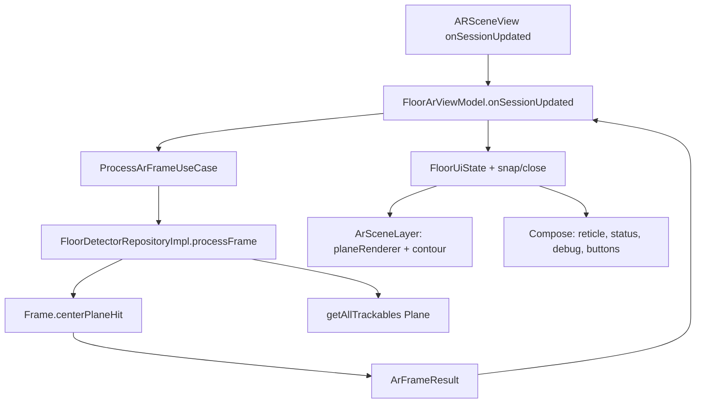
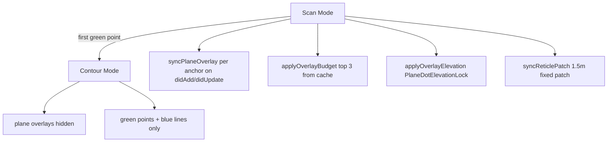

# Обнаружение горизонтальных поверхностей (Android и iOS)

Документ описывает, как приложение **AR Plitka** находит пол и другие горизонтальные поверхности, как отображает их пользователю и чем отличаются реализации на Android (ARCore) и iOS (ARKit).

**Для агентов и разработчиков:**

- **Android** — [статус и договорённости](#android--статус-и-договорённости): эталон поиска пола и **полный** flow контура/плитки.
- **iOS** — [статус и договорённости](#ios--статус-и-договорённости): поиск и отображение поверхностей; **стратегия:** [IOS_AR_SURFACE_STRATEGY.md](./IOS_AR_SURFACE_STRATEGY.md); **стабильность точек контура:** [ios-ar-point-stability.md](./ios-ar-point-stability.md).

## Цель UX

Пользователь ходит по комнате с камерой и видит **белую surface-сетку в 3D** — быстрый preview найденных горизонтальных поверхностей. Поверхность должна:

- обнаруживаться **динамически** при движении;
- быть **горизонтальной** (пол, стол, кровать сверху);
- быстро показывать отфильтрованный набор useful horizontal planes, а прицел использовать для статуса и добавления точек;
- давать понятный статус: «ищем», «найдено», площадь, center hit.

---

## Общие понятия

| Понятие | Описание |
|--------|----------|
| **Horizontal plane** | Горизонтальная плоскость, которую строит AR-движок (пол, стол и т.д.) |
| **Center reticle** | Перекрестие в центре экрана; по нему определяется «активная» поверхность |
| **Center hit** | Попадание луча из центра экрана в отслеживаемую горизонтальную плоскость |
| **Selected / focused plane** | Плоскость под прицелом для статуса и placement; scan-визуал может показывать больше surfaces |
| **MIN_FLOOR_AREA_M2** | Минимальная площадь **0.15 m²**, чтобы считать поверхность пригодной |

Общий UI-kit (`shared/ui/kit`): `CenterReticle`, `StatusPanel`, `DebugPanel` — используется на обеих платформах.

### Phase-derived visibility (shared + Android)

Условия «что рисовать на каком этапе» — **computed properties** в state, не размазаны по UI:

| Флаг | Android `FloorUiState` | iOS `FloorContourUiState` |
|------|------------------------|---------------------------|
| Белые точки / plane | `showPlaneRenderer` | `showPlaneDots` / `showPlaneRenderer` |
| Зелёные точки | `showContourPoints` | `showContourPoints` |
| Синие линии | `showContourLines` | `showContourLines` |
| Preview-линия | `showPreviewLine` (к прицелу) | **выкл.** — синие линии только между поставленными точками (≥2) |
| Заливка секции | `showSectionFill` | `showSectionFill` |
| Плитка (будущее) | `isTileVisible` | `isTileVisible` (пока false на iOS) |

Правило: **белые точки видны до finalize контура** (`!isContourConfirmed` / `!isFinalized`). После OK белые точки скрываются, остаётся разметка.

---

## Android — статус и договорённости

### Статус (зафиксировано, июнь 2026)

| Решение | Суть |
|---------|------|
| **Эталон продукта** | Android — **референс** по UX поиска пола и по полному циклу разметки (точки → контур → OK → заливка → плитка). iOS подтягивается к этому поведению, а не наоборот. |
| **Поиск поверхности не «лочим»** | Нет фиксации одной рабочей плоскости: пользователь **постоянно** видит обновление горизонтальных plane и может перевести прицел на другую поверхность. Явное требование продукта (отказ от `FloorLocked`). |
| **Визуализация пола — нативная** | Белые точки/сетка плоскостей рисует **`planeRenderer` SceneView/ARCore**, не кастомная mesh-сетка как на iOS. |
| **Логика «где можно ставить точку»** | Только plane **под прицелом** с `isPoseInPolygon` и `area >= 0.15 m²` — это отдельно от «всех видимых» planes renderer. |
| **Не тюним detection без запроса** | Не менять `centerPlaneHit`, порог площади, `planeRenderer` toggle, конфиг ARCore без явной задачи — риск регрессии эталона. |
| **Контур на Android — готов** | Зелёные точки, синие линии, preview, snap/close, OK → confirm → tile — в `FloorArViewModel` + `ArSceneLayer`. |

### Что сделано (поиск + отображение поверхности)

- **ARCore** horizontal plane finding, `LATEST_CAMERA_IMAGE`.
- **Depth** `AUTOMATIC`, если устройство поддерживает.
- **Center hit** из центра viewport: `Frame.hitTest` + фильтр `HORIZONTAL_UPWARD_FACING` + **`Plane.isPoseInPolygon(hitPose)`** (граница полигона ARCore).
- **`selectedPlane`** только под прицелом; площадь `extentX × extentZ`.
- **`showPlaneRenderer`** = `!isContourConfirmed` — белые точки ARCore скрываются после подтверждения контура.
- **Clean Architecture**: `FloorDetectorRepositoryImpl` → `ArFrameResult` (данные), `FloorArViewModel` → `FloorUiState` (UI).
- **Debug-панель** только в debug-сборке (`isDebugBuild()`).

### Что сделано (контур и плитка — эталон для iOS)

| Этап | Поведение |
|------|-----------|
| Прицел | `CenterReticle` активен при `hasCenterHit && !isContourConfirmed` |
| «+» | Точка в `currentHitResult`, anchor на hit pose |
| Линии | Между точками; preview к прицелу |
| Snap / close | Snap 0.02 m; замыкание к первой 0.10 m (≥3 точек) |
| OK (замкнут) | `confirmContour()` → синяя заливка, plane renderer off |
| Плитка | Toggle, смена типа, поворот 0°/45°/90°/135° |
| Стабильность Y | Контур/линии/заливка на **Y первой точки** (`sectionFloorY`), чтобы точки не «плыли» при drift anchor |

### Что сознательно не делаем на Android

| Тема | Причина |
|------|---------|
| **Focused-only белые точки** как на iOS | На Android делегируем визуализацию ARCore; отдельная mesh-сетка не нужна. |
| **Ограничение dots радиусом 2 m** | Нет в Android path; ограничение границ — полигон ARCore + выбор center plane. |
| **«Комната как модель»** | ARCore не знает плинтусы; точки renderer могут уходить за стену, пока plane не разделился. |
| **Фиксация пола после первого detect** | Отменено по продукту. |

### Ограничения среды

- **Тени и тёмные углы** — качество tracking зависит от устройства (обсуждалось на Poco F5); depth и HDR помогают, но не гарантируют.
- **Несколько horizontal planes** (пол + стол) — renderer показывает **все**, может быть шумно; бизнес-логика всё равно по center hit.
- **Плинтус / стена** — hit и визуализация могут выходить за реальную комнату, пока ARCore не уточнит границу plane.

### Критерии «не ломать» при правках

1. `planeRenderer` включён, пока контур **не** подтверждён (`showPlaneRenderer`).
2. Center hit только внутри **polygon** plane под прицелом.
3. `isFloorDetected` только при `selectedArea >= 0.15 m²`.
4. Нет возврата **lock** одной плоскости на весь сеанс.
5. После `confirmContour` — заливка, plane dots скрыты, контурные anchors остаются.
6. Точки контура не уезжают по Y относительно первой точки при обычном drift (проверка `sectionFloorY`).

---

## Android (ARCore) — реализация

### Стек

| Компонент | Путь |
|-----------|------|
| Feature-модуль | `features/floor-detection` |
| AR-сцена | `presentation/components/ArSceneLayer.kt` |
| Детекция кадра | `data/repository/FloorDetectorRepositoryImpl.kt` |
| Hit-test | `shared/ar/core/ArExtensions.kt` |
| UI state | `presentation/viewmodel/FloorArViewModel.kt` |
| Экран | `presentation/screen/FloorArScreen.kt` |

### Конфигурация AR-сессии

`ArSceneLayer.kt`:

```kotlin
config.planeFindingMode = Config.PlaneFindingMode.HORIZONTAL
config.lightEstimationMode = Config.LightEstimationMode.ENVIRONMENTAL_HDR
config.depthMode = Config.DepthMode.AUTOMATIC  // если supportsSceneReconstruction / depth supported
config.focusMode = Config.FocusMode.AUTO
config.updateMode = Config.UpdateMode.LATEST_CAMERA_IMAGE
planeRenderer = uiState.showPlaneRenderer  // !isContourConfirmed
```

### Поток данных (каждый кадр)



### Center hit

`ArExtensions.kt`:

```kotlin
fun Frame.centerPlaneHit(viewportSize: IntSize): HitResult? {
    val hits = hitTest(viewportSize.width / 2f, viewportSize.height / 2f)
    // первый Plane: HORIZONTAL_UPWARD_FACING, TRACKING, isPoseInPolygon(hitPose)
}
```

### «Поверхность обнаружена»

`FloorDetectorRepositoryImpl.kt`:

```kotlin
val selectedPlane = (centerHit?.trackable as? Plane)?.takeIf {
    it.isUsableHorizontalPlane() && it.area() >= MIN_FLOOR_AREA_M2  // 0.15f
}
isFloorDetected = selectedPlane != null
hasCenterHit = centerHit != null
selectedArea = selectedPlane?.area() ?: max horizontal plane area
```

### UI-состояния (detection)

| Условие | `status` | `instruction` |
|---------|----------|---------------|
| `trackingState != TRACKING` | `TRACKING_LOST` | `MOVE_PHONE` |
| TRACKING, нет floor | `SEARCHING_FLOOR` | `SEARCHING` |
| TRACKING, floor найден | `FLOOR_DETECTED` / `POLYGON_CLOSED` | `DETECTED` / … |

### Phase flags (`FloorUiState`)

| Флаг | Условие |
|------|---------|
| `showPlaneRenderer` | `!isContourConfirmed` |
| `showContourPoints` | `points.isNotEmpty() && !isTileVisible` (iOS shared: точки остаются после confirm) |
| `showContourLines` | `points.size >= 2 && !isTileVisible` |
| `showPreviewLine` | есть точки, не closed, есть `currentHitPose` |
| `showSectionFill` | closed + ≥3 точек (preview при `Closed: Yes`, сохраняется после confirm) |

### Debug (только debug build)

Planes, Area, Tracking, Points, Closed, Confirmed, Tile, Texture rotation — `FloorArScreen.kt`.

### Ключевые файлы

| Файл | Роль |
|------|------|
| `ArSceneLayer.kt` | ARSession, planeRenderer, contour/fill/tile 3D |
| `FloorDetectorRepositoryImpl.kt` | Кадр → `ArFrameResult`, без UiState |
| `ArExtensions.kt` | `centerPlaneHit`, `area()`, `isUsableHorizontalPlane` |
| `ProcessArFrameUseCase.kt` | Use case обёртка |
| `FloorArViewModel.kt` | UiState, точки, confirm, tile |
| `FloorArScreen.kt` | Compose, debug, кнопки |
| `FloorArRenderConfig.kt` | Размеры точек/линий/заливки |
| `FloorModels.kt` | `FloorUiState`, derived visibility |

---

## iOS — статус и договорённости

> **Стратегия, outdoor-анализ, план A/B:** [IOS_AR_SURFACE_STRATEGY.md](./IOS_AR_SURFACE_STRATEGY.md)

### Статус (июнь 2026, scan multi-surface + contour mode)

| Решение | Суть |
|---------|------|
| **Scan viz** | До **3** overlays по `ARPlaneAnchor` (polygon grid), incremental на `didAdd`/`didUpdate`; budget + dedup **10 cm** по Y в `didUpdateFrame`. Патч **1.5 m** под прицелом (estimated/elevated). |
| **Scan viz ≠ статус** | Визуал может показывать крупные planes **вне прицела** (как Android `planeRenderer`); баннер «обнаружено» — только confirmed ≥ 0.15 m² **под прицелом** (фаза A.2 ✅). |
| **Contour mode** | После **первой** зелёной точки scan-сетки **скрываются** (`contour-hidden`). |
| **Placement** | Кнопка «+» — только **confirmed** hit (отдельный этап; не в фокусе surface-плана). |
| **Паритет с Android** | Android — эталон detection; статус «обнаружено» выровнен (A.2); scan-viz догоняем в **фазе A+**. |
| **Смена локации** | Призраки planes при улица→дом — фикс **A+**: relocation reset + distance cull + «Пересканировать». |
| **Legacy** | `IosArPlaneRenderer.kt` — boundary helpers; не в runtime scan path. |
| **Окклюзия плитки** | **Вне scope** до отдельного решения продукта. |

**План по скринам тестировщиков:** [IOS_AR_SURFACE_STRATEGY.md §5.5, §8](./IOS_AR_SURFACE_STRATEGY.md) (фазы A+ → A.5 → B).

### Что сделано (план ios-ar-rebuild + фазы A+ / B)

- `IosArPlaneSurfaceRenderer` — **polygon grid** (world-space белые линии) per anchor; reticle patch 1.5×1.5 m.
- `IosArCenterRaycast.kt` — **`pg_center_raycast`** (ARRaycast) + hitTest fallback + mesh raycast (B.5).
- Bridge: `pg_create_polygon_grid_line_geometry`, `pg_create_grid_line_geometry`, classification, outdoor strict.
- `applyOverlayElevation` — `PlaneDotElevationLock`: сетка лежит на полу, компенсация дрейфа ARKit вверх.
- Dedup по высоте: на одном уровне (±10 cm) — только **крупнейшая** plane (визуальный аналог ARCore subsuming).
- `didUpdateFrame` — raycast, focus, `FloorArController.onFrame`, debug FPS; **без** dot mesh rebuild.
- Preview hit (estimated plane) — только для **поиска** поверхности в scan mode (`hasCenterHit` до первой точки).
- LiDAR mesh optional; Compose UI throttled через `publishIfUiChanged`.

### Что отложено

| Тема | Причина |
|------|---------|
| **Белые точки во время разметки** | Продуктово конфликтует с FPS; fallback — статический snapshot, не live mesh. |
| **Синяя заливка, плитка, rotate** | После стабильного контура на устройстве. |
| **Merge якорей ARKit** | API iOS не даёт subsuming как ARCore; dedup только на уровне визуала и sticky floor. |

### Критерии «не ломать»

1. В **contour mode** debug: `Plane renderer` = `contour-hidden`, без фризов при 2–5 точках.
2. В **scan mode**: overlays обновляются на anchor events, не в `didUpdateFrame`.
3. Placement только confirmed hit; точки не дрейфуют от anchor refine.
4. `showPlaneDots` скрывает surface после finalize.
5. Сборка на Mac: `./gradlew :iosApp:linkDebugFrameworkIosArm64`.

---

## iOS (ARKit) — реализация

### Стек

| Компонент | Путь |
|-----------|------|
| Экран + сессия | `iosApp/.../IosArScreen.ios.kt` |
| Surface v2 (polygon grid lines) | `iosApp/.../IosArPlaneSurfaceRenderer.kt` |
| Center hit (ARRaycast) | `iosApp/.../IosArCenterRaycast.kt` |
| AR-конфиг (LiDAR) | `iosApp/.../IosArSessionConfiguration.kt` |
| Bridge (polygon grid, raycast) | `PlaneGeometryBridge.h`, `plane_geometry_bridge.def` |
| Legacy dot mesh (не в runtime) | `iosApp/.../IosArPlaneRenderer.kt` |
| Контур (зелёный) | `IosArContourRenderer.kt`, `IosFloorAnchorStore.kt` |
| Shared state | `shared/ar/domain` — `FloorArController`, `FloorContourUiState` |

### Конфигурация AR-сессии

`IosArSessionConfiguration.kt`:

```kotlin
createWorldTrackingConfiguration(enableLidarMesh = true)
// planeDetection = horizontal
// sceneReconstruction = mesh  // только если supportsSceneReconstruction(mesh)
```

Debug **AR features**: `lidar-mesh+planes` или `planes`.

### Center hit

`IosArCenterRaycast.kt` — **`pg_center_raycast`** (ARRaycast) + hitTest fallback + mesh raycast (B.5):

1. **Confirmed:** `ExistingPlaneUsingExtent` → horizontal `ARPlaneAnchor` + local (x, z); confirmed = точка внутри boundary (`containsLocalPoint`).
2. **Preview:** `EstimatedHorizontalPlane` резолвится всегда для scan feedback и широкого estimated carpet.

Debug **Hit path**: `c:hit_test/p:hit_test` (или `none`).

### Режимы: Scan vs Contour



### Поток данных

**`didUpdateFrame`** (scan, `placedPoints.isEmpty()`):

- **`syncPlaneOverlayOnNodeEvent`** — сетка на plane **сразу при didAdd** (без ожидания «выбора одной» плоскости). Geometry throttle ~120 ms на anchor.
- **`applyOverlayBudget`** — в `didUpdateFrame` только **скрывает лишнее** по кэшу area (до **3** surfaces), без полного пересчёта geometry всех anchors → нет фриза 2–3 с.
- **`applyOverlayElevation`** — каждый кадр: `PlaneDotElevationLock` опускает overlay к **минимальной** виденной высоте пола (ARKit часто поднимает anchor при refine).
- **`syncReticlePatch`** — патч **1.5×1.5 m** под прицелом (estimated/elevated); позиция из hit transform, **без** Y-offset.
- Sticky floor id переключается только если новая plane **>18%** больше по area (нет thrashing).

**`didUpdateFrame`** (общее):

- `resolveCenterPlaneHit` (throttle в contour mode: каждый 3-й кадр).
- `FocusedPlaneTracker` — только статус, area, доступность «+» (не решает, какие overlays рисовать).
- `FloorArController.onFrame` + `publishIfUiChanged`.
- **Нет** dot mesh rebuild / buckets в coordinator path (elevation lock — только для surface grid).

### Center hit и placement

1. **Confirmed:** `ExistingPlaneUsingExtent` + `containsLocalPoint` — для «+» и `currentHitPoint` в contour mode.
2. **Preview:** `EstimatedHorizontalPlane` — для `hasCenterHit` и reticle patch в scan mode (до первой точки); patch на полу не рисуется (есть floor overlay); на возвышенных поверхностях — сразу; не для placement.

`placementWorldFloorPoint()` / `placementWorldTransform()` — **только confirmed**.

### Контурные точки

| Компонент | Поведение |
|-----------|-----------|
| `IosFloorAnchorStore` | Root `ARAnchor` + `rootLocalX/Z`; resolve из transform anchor; политика micro / auto-small / manual macro |
| `IosArContourRenderer` | `syncIfChanged` на add/undo/close |
| Preview-линия к прицелу | **выкл.** (как Android policy для iOS) |
| Manual realign | Кнопка «Выровнять контур» при сдвиге ≥ 8 см после нестабильности трекинга |

Подробности: [ios-ar-point-stability.md](./ios-ar-point-stability.md).

### UI и debug

- Debug: **Plane renderer** (`scan-floor` / `scan-floor+reticle` / `scan-reticle-patch` / `contour-hidden`), **Surface overlays** (0–3), FPS, hit path (`c:raycast_*` / `p:hit_test`).
- Reticle в contour: активен только при **confirmed** hit.

### Ключевые файлы

| Файл | Роль |
|------|------|
| `IosArScreen.ios.kt` | Coordinator, scan/contour modes, rescan |
| `IosArSessionRelocation.kt` | Auto/manual scan session reset (A+) |
| `IosArPlaneSurfaceRenderer.kt` | Surface v2 polygon grid, cull/elevated (A+), elevation lock |
| `IosArCenterRaycast.kt` | Center hit (`pg_center_raycast` + hitTest fallback) |
| `IosArContourRenderer.kt` | Event-driven contour |
| `IosFloorAnchorStore.kt` | Anchor-based contour positions + correction policy |
| `IosArPlaneRenderer.kt` | Legacy helpers (не coordinator path) |

---

## Сравнение Android vs iOS

| Аспект | Android (ARCore) — эталон | iOS (ARKit) |
|--------|-------------------------|-------------|
| Роль в продукте | Референс detection + **полный контур/плитка** | Surface зафиксирован; контур — догнать Android |
| Визуализация пола | Нативный `planeRenderer` (все horizontal planes) | Polygon grid overlay + reticle patch только без floor под прицелом |
| Скорость в contour mode | N/A | Surface **скрыта** после 1-й точки |
| Выбор поверхности | Center hit + **`isPoseInPolygon`** | Confirmed extent hit + boundary check |
| Фиксация одного пола | **Нет** (постоянный поиск) | Contour mode stops surface updates |
| След при ходьбе | ARCore renderer | Extent grows with ARKit (overlay resize) |
| Окно под прицелом | Полигон plane + center | Scan-визуал широкий; placement только confirmed center |
| Center hit API | `Frame.hitTest` | `pg_center_raycast` (+ hitTest fallback) |
| Depth / LiDAR | Depth automatic | sceneReconstruction mesh optional |
| Min area | 0.15 m² | 0.15 m² |
| Белые точки до confirm | `showPlaneRenderer` | `showPlaneDots` |
| Контур + заливка + плитка | ✅ | ❌ (в работе) |

---

## Известные ограничения

### Обе платформы

- AR не знает «комнату» целиком; plane может уходить за плинтус.
- Качество: свет, текстура пола, скорость движения.

### Android (актуально)

- **`planeRenderer`** показывает **все** horizontal planes — может быть шумно (пол + стол); бизнес-логика — только center hit в **polygon**.
- **Плинтус / стена** — hit и визуализация могут выходить за реальную комнату, пока ARCore не уточнит границу plane.
- **Тени и тёмные углы** — tracking и depth зависят от устройства; не блокер регрессии без сравнения с эталоном на том же девайсе.
- **Не менять** detection/planeRenderer без явной задачи — Android зафиксирован как эталон.

### iOS (актуально)

- B.1–B.5 реализованы: ARRaycast bridge, polygon grid, outdoor strict mode, classification filter, mesh raycast pilot.
- Surface v2 — **polygon grid** (B.2 ✅); reticle patch только при отсутствии floor overlay под прицелом.
- **Призраки сессии:** ARKit не чистит старые planes при смене физической локации без reset — сетки «в воздухе» (фикс A+.1–A+.2).
- **Плитка vs ступени:** polygon grid + classification suppress table/seat; elevated planes Y > floor + 15 cm скрываются (A+.4, B.4).
- **Перекрывающиеся planes:** ARKit может держать несколько якорей на одном полу; приложение **не сливает** якоря — dedup ±10 cm показывает одну сетку; hit/placement — только plane **под прицелом**.
- **Трава:** confirmed hit под прицелом часто отсутствует → статус «ищем» корректен; scan-viz слабее Android dots (фикс A+.5).
- Scan-визуал — UX-индикатор найденных поверхностей, не источник точек.
- В contour mode белые точки **скрыты** — намеренно для FPS.
- Не возвращать per-frame dot-mesh rebuild в `didUpdateFrame`.

---

## Сборка и тест

### Android

Устройство с **ARCore**. Экран: `FloorArScreen`, модуль `features/floor-detection`.

```bash
./gradlew :app:installDebug
# или :features:floor-detection:assembleDebug
```

### Чеклист регрессии Android (поверхность + контур)

| # | Проверка | Ожидание |
|---|----------|----------|
| 1 | Старт AR, пол в кадре | Белые точки `planeRenderer`, status searching → detected |
| 2 | Прицел на пол | Reticle активен, `hasCenterHit`, area ≥ 0.15 m² |
| 3 | Сдвиг на стол/кровать | Renderer показывает useful planes после фильтра; постановка точек — только confirmed/polygon |
| 4 | Нет «залипания» одного пола | Уход с плоскости → снова searching (без lock) |
| 5 | «+» — 3+ точки, замкнуть | Snap к первой (0.10 m), closed, кнопка OK |
| 6 | OK → confirm | `planeRenderer` **выкл**, синяя заливка |
| 7 | Плитка | Toggle, rotate 0°/45°/90°/135°, смена типа |
| 8 | Y контура | Точки/линии на высоте **первой** точки при ходьбе |
| 9 | Debug | Только debug APK; release без панели |
| 10 | Несколько horizontal planes | Renderer может показывать все; постановка точек — только под прицелом в polygon |

### iOS

```bash
./gradlew :iosApp:linkDebugFrameworkIosArm64
```

Xcode, **реальный iPhone**. Экран: `IosArScreen`.

### iOS Debug Panel — справочник полей

Панель видна только в **debug** build (`isDebugBuild()`). Обновляется ~4 раза в секунду; **Delegate Hz** пересчитывается раз в 1 с (скользящее окно).

#### Производительность (главное для диагностики лагов)

| Поле | Что измеряет | Норма / тревога |
|------|----------------|-----------------|
| **Phase** | Этап сессии: `scan` (0 точек), `placement` (контур в работе), `contour` (сетка скрыта после OK) | — |
| **Perf** | Авто-вывод узкого места по трём метрикам ниже | `ok` — хорошо; `delegate blocked` / `handler blocked` — плохо |
| **Delegate Hz** | Сколько раз в секунду **завершился** наш `ARSessionDelegate.session(_:didUpdateFrame:)` | ≈ `1000 / Camera gap`. Если Camera gap ~33 ms, а Delegate Hz = 1 — обработчик не успевает |
| **Camera gap** | Интервал между соседними `ARFrame.timestamp` (частота **доставки** кадров ARKit) | ~33 ms ≈ 30 Hz; ~16 ms ≈ 60 Hz; >200 ms — редкие кадры от ARKit |
| **Frame work** | Wall-clock время **последнего** полного прохода `didUpdateFrame` (hit-test, overlays, контур) | <33 ms — ок для 30 Hz; >100 ms — тяжело; >250 ms — блокирует поток |

**Как читать Perf:**

| Значение Perf | Значит |
|---------------|--------|
| `warming up` | Первый кадр, метрикам нужна 1–2 с |
| `ok (delegate ~Nhz)` | Камера и обработчик согласованы |
| `handler heavy (Nms)` | Обработчик тяжёлый, но ещё не критично |
| `handler blocked (Nms)` | Один кадр обрабатывался >250 ms |
| `delegate blocked (camera ok)` | ARKit шлёт кадры нормально, мы успеваем ~1 Hz |
| `delegate behind camera` | Кадры приходят чаще, чем мы их обрабатываем |
| `camera sparse (~Nhz)` | Мало кадров от ARKit (трекинг / сессия) |

> **Важно:** старое поле **«Plane FPS»** удалено — оно показывало Delegate Hz, но называлось так, будто это FPS отрисовки сетки. Это вводило в заблуждение.

Связанный чеклист прогона: [IOS_AR_CONTINUOUS_FLOOR_PLACEMENT_PLAN.md §7](./IOS_AR_CONTINUOUS_FLOOR_PLACEMENT_PLAN.md#7-шаг-1--диагностика-на-устройстве-перед-фазой-a).

#### Поверхность и hit

| Поле | Что значит |
|------|------------|
| **Plane renderer** | Режим визуализации: `scan-multi-surface`, `continuous-floor`, `continuous-floor+explore`, `contour-hidden`, … |
| **Surface overlays** | Число видимых белых сеток (scan overlay + reticle/placement patch) |
| **Planes** | Число horizontal plane anchors в кадре |
| **Focused** | Какая плоскость в фокусе под прицелом (`surface/1`, `patch/1`, `No`, …) |
| **Reticle area** | Площадь plane anchor под прицелом (m²), только при confirmed |
| **Largest plane** | Площадь крупнейшего кэшированного plane (m²) |
| **Center hit** | Есть ли hit под прицелом для UI/кнопки «+» |
| **Hit path** | Источник hit: `c:hit/p:est` = confirmed hitTest, preview estimated, … |
| **Detect gate** | `confirmed` или `searching` — строгий статус «обнаружено» |
| **Scan patch** | Scan: `on`, `off`, `search-on`; placement: `explore-on`, `fallback-on` |
| **Placement** | В placement mode: `valid`, `preview`, `stale`, `height`, `no-hit`, … |
| **Hit age** | Возраст последнего center hit (мс); >700 ms → `stale` |
| **Tap frame age** | Сколько мс прошло с последнего `didUpdateFrame`; >150 ms → тап блокируется; суффикс `(stale)` |
| **Tap Δ** | Расхождение preview hit и поставленной точки при последнем тапе (см); >5 см — подозрительно |
| **Track quality** | `ok` / `degraded` / `debounce` / `degraded+debounce` — деградация трекинга и debounce transform |
| **Hit Y** | Высота hit: `raw` / `sec` (уровень контура) / `d` (дельта) |
| **Cull** | Статистика отсечения overlays: `d:` по дистанции, `e:` elevated/classification |
| **Reloc** | Состояние relocation / auto reset сессии |
| **Anchor corr** | Коррекция контура: `{state} r:{rootCm} d:{displayCm}` — см. [ios-ar-point-stability.md](./ios-ar-point-stability.md) |
| **AR features** | Включённые фичи сессии (planes, mesh, …) |

#### Контур

| Поле | Что значит |
|------|------------|
| **Tracking** | `TRACKING`, `LIMITED`, `NOT_AVAILABLE` |
| **Points** | Число поставленных точек контура |
| **Closed** | Контур замкнут (`Yes` / `No`) |

### Чеклист регрессии iOS (поверхность + контур)

**Базовый (contour + scan):**

| # | Проверка | Ожидание |
|---|----------|----------|
| 1 | Старт AR, навести на пол | `scan-multi-surface`, сетка пола быстро |
| 1b | Прицел на стол/тумбу | `scan-multi+reticle` или `scan-reticle-patch`; патч 1.5 m; «+» только confirmed |
| 2 | До первой точки | Сетка видна, FPS стабилен |
| 3 | Первая зелёная точка | **Нет** фриза ~6 с; `contour-hidden` |
| 4 | 2–5 точек + undo | Точки под прицелом (confirmed), линии между точками |
| 5 | Замыкание / OK | Контур стабилен, без preview-линии к прицелу |
| 6 | Delegate Hz / Perf | В scan и placement: Perf ≠ `delegate blocked`; Frame work <100 ms |
| 7 | Reticle в scan | Активен при confirmed (фаза A.2) |
| 8 | Reticle в contour | Только при **confirmed** |
| 9 | Area ≥ 0.15 под прицелом | Status «обнаружено» |
| 10 | Undo все точки | Surface снова `scan-multi-surface` |
| 11 | Лёгкий фриз трекинга, сдвиг 3–8 см | `Anchor corr: auto-small`, точки возвращаются без кнопки |
| 12 | Потеря трекинга, сдвиг ≥ 8 см | Кнопка «Выровнять контур»; после нажатия `Anchor corr: manual` |
| 13 | Обычная работа | `Anchor corr: micro`, нет рывков контура |

Подробный чеклист: [ios-ar-point-stability.md §8](./ios-ar-point-stability.md#8-чеклист-регрессии).

**По скринам тестировщиков (фаза A.5, после A+):**

| # | Сценарий | Ожидание |
|---|----------|----------|
| S1 | **Плитка на улице**, светло | Статус «обнаружено»; сетки на плитке; **нет** сетки на ступенях |
| S2 | **Трава** | Статус «ищем» без confirmed под прицелом; **видна** сетка крупнейшего plane; debug `Largest plane` > 0 |
| S3 | **Улица → лестница** без выхода из AR | Нет сеток в воздухе; нет уличных призраков; `Reloc`/`Cull` в debug при reset |
| S4 | **Выход → вход** в AR | Полный reset (`RemoveExistingAnchors`), чистая сцена |
| S5 | **«Пересканировать»** (A+.6) | То же, что S4, без выхода с экрана |

---

## Константы iOS (surface v2)

| Константа | Файл | Значение | Назначение |
|-----------|------|----------|------------|
| `GRID_CELL_METERS` | `IosArPlaneSurfaceRenderer.kt` | **0.60 m** | Шаг сетки в world space |
| `GRID_LINE_WIDTH_M` | `IosArPlaneSurfaceRenderer.kt` | **0.015 m** (1.5 cm) | Толщина линий сетки в world space |
| `RETICLE_SURFACE_PATCH_M` | `IosArPlaneSurfaceRenderer.kt` | 1.5 m | Фикс. патч под прицелом (стол, тумба, новая зона) |
| `MIN_RENDER_AREA_M2` | `IosArPlaneSurfaceRenderer.kt` | 0.15 m² (= `MIN_FLOOR_AREA_M2`) | Мин. area для overlay |
| `MAX_PLANE_ABOVE_CAMERA_M` | `IosArPlaneSurfaceRenderer.kt` | 0.25 m | Скрыть plane «в воздухе» над камерой |
| `MAX_RETICLE_HIT_DISTANCE_M` | `IosArPlaneSurfaceRenderer.kt` | 5.0 m | Max distance для scan patch |
| `SAME_LEVEL_Y_DELTA_M` | `IosArPlaneSurfaceRenderer.kt` | 0.10 m | На одном уровне — рисуем только самую большую plane (dedup overlap) |
| `PlaneDotElevationLock` | `IosArPlaneRenderer.kt` + surface renderer | per-anchor min Y | Сетка на полу, не «парит» при refine anchor |
| Grid material | `IosArPlaneSurfaceRenderer.kt` | `writesToDepthBuffer = true` | Корректная глубина; геометрия в local y=0 |
| `ELEVATED_Y_DELTA_M` | `IosArPlaneSurfaceRenderer.kt` | 0.10 m | Пол vs возвышенная / патч под прицелом |
| `MAX_OVERLAY_DISTANCE_M` | `IosArPlaneSurfaceRenderer.kt` | **10 m** | Cull overlay дальше от камеры (A+) |
| `ELEVATED_SUPPRESS_DELTA_M` | `IosArPlaneSurfaceRenderer.kt` | **0.15 m** | Скрыть elevated при доминирующем floor (A+) |
| `STICKY_FLOOR_Y_RESET_M` | `IosArPlaneSurfaceRenderer.kt` | **1.0 m** | Сброс sticky floor при смене уровня (A+) |
| `RELOCATION_RESET_COOLDOWN_S` | `IosArSessionRelocation.kt` | **3 s** | Анти-фликер auto reset |
| `DISTANT_PLANE_RESET_RATIO` | `IosArSessionRelocation.kt` | **0.6** | Auto reset при 60%+ planes далеко |
| Polygon grid | `plane_geometry_bridge.def` | `pg_create_polygon_grid_line_geometry` | Сетка по `ARPlaneGeometry` boundary, клип внутри полигона |
| Reticle patch | `IosArPlaneSurfaceRenderer.kt` | 1.5×1.5 m extent | Только когда **нет** floor overlay под прицелом |
| `MAX_SURFACE_OVERLAYS` | `IosArPlaneSurfaceRenderer.kt` | **3** | Лимит overlays; 1 на уровень пола |
| `MIN_FLOOR_AREA_M2` | `IosArPlaneRenderer.kt` | 0.15 m² | Порог «обнаружено» |
| `FOCUS_GRACE_FRAMES` | `IosArPlaneRenderer.kt` | 4 | Grace без hit для UI/status |
| `GRID_VISUAL_OFFSET_M` | `IosArPlaneRenderer.kt` (legacy dots) | 0.0005 m | Только dot mesh; surface grid **не** использует |
| `MESH_REBUILD_MIN_INTERVAL_SECONDS` | `IosArPlaneRenderer.kt` | 0.08 s | Throttle legacy dot mesh |
| `CENTER_FINGERPRINT_STEP_M` | `IosArPlaneRenderer.kt` | 0.18 m | Квантование fingerprint |
| `FLOOR_DOT_RADIUS_M` | `IosArPlaneRenderer.kt` | 0.013 m | Радиус диска (legacy) |
| `MIN_FLOOR_AREA_M2` | 0.15 m² | Порог «обнаружено» |
| `MAX_GENERATED_DOT_POINTS` | 768 | Лимит точек в mesh |

---

## Константы Android

### Detection (`FloorDetectorRepositoryImpl`)

| Константа | Значение |
|-----------|----------|
| `MIN_FLOOR_AREA_M2` | **0.15** m² |

### Контур (`FloorArViewModel`)

| Константа | Значение |
|-----------|----------|
| `CLOSE_THRESHOLD_M` | 0.10 m (замыкание к первой) |
| `SNAP_THRESHOLD_M` | 0.02 m |
| `MAX_POINT_HEIGHT_DELTA_M` | 0.08 m |

### 3D-визуализация (`FloorArRenderConfig.kt`)

| Константа | Значение |
|-----------|----------|
| `POINT_RADIUS_M` | 0.016 m |
| `POINT_VISUAL_OFFSET_M` | 0.008 m |
| `LINE_WIDTH_M` | 0.012 m |
| `LINE_VISUAL_OFFSET_M` | 0.003 m |
| `PREVIEW_LINE_WIDTH_M` | 0.016 m |
| `FILL_VISUAL_OFFSET_M` | 0.001 m |
| `TILE_TEXTURE_WIDTH_M` | 0.78 m |
| `TILE_TEXTURE_HEIGHT_M` | 1.04 m |

### ARCore session

| Параметр | Значение |
|----------|----------|
| `planeFindingMode` | `HORIZONTAL` |
| `updateMode` | `LATEST_CAMERA_IMAGE` |
| `depthMode` | `AUTOMATIC` (если поддерживается) |

---

## Связанные документы

| Документ | Содержание |
|----------|------------|
| `features/floor-detection/README.md` | Android feature-модуль |
| `shared/ui/kit/README.md` | AR UI kit |
| `docs/BACKEND_MOCKING_PLAN.md` | AR platform-specific в KMP |
| План (Cursor) `ios-plane-speed` | История оптимизаций; todos completed; ARRaycast → hitTest |

---

## История изменений (кратко)

| Дата | Изменение |
|------|-----------|
| 2026-05–06 | Android: постоянный поиск пола, отказ от lock; `isPoseInPolygon`; derived visibility в `FloorUiState` |
| 2026-05–06 | Android: контур, заливка, плитка; `sectionFloorY` против drift точек |
| 2026-06 | iOS: план ios-plane-speed — mesh, accumulate+live, metrics, elevation lock |
| 2026-06 | iOS: ARRaycast откатан (K/N bindings); hitTest |
| 2026-06 | **Договорённости:** Android = эталон; iOS surface зафиксирован; iOS контур — следующий этап |
| 2026-06 | Документ: разделы «статус и договорённости» для Android и iOS |
| 2026-06 | iOS фаза A в коде: confirmed-only gate, patch filters, overlay budget |
| 2026-06 | Скрины: плитка / трава / лестница-призраки → план **A+** в [IOS_AR_SURFACE_STRATEGY.md](./IOS_AR_SURFACE_STRATEGY.md) |
| 2026-06 | iOS фаза **B** (B.1–B.5): ARRaycast bridge, polygon grid, outdoor strict, classification, mesh raycast |
| 2026-06 | Grid lines: world-space 1.5 cm; elevation lock для surface; dedup overlap ±10 cm задокументирован |
