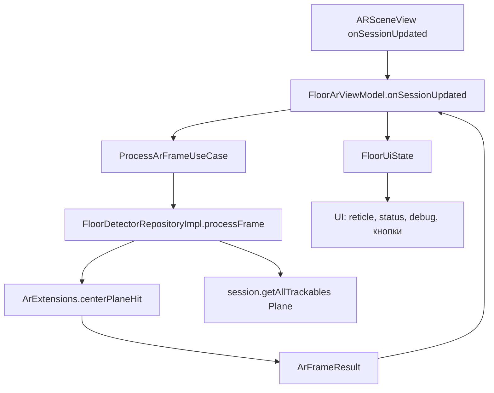
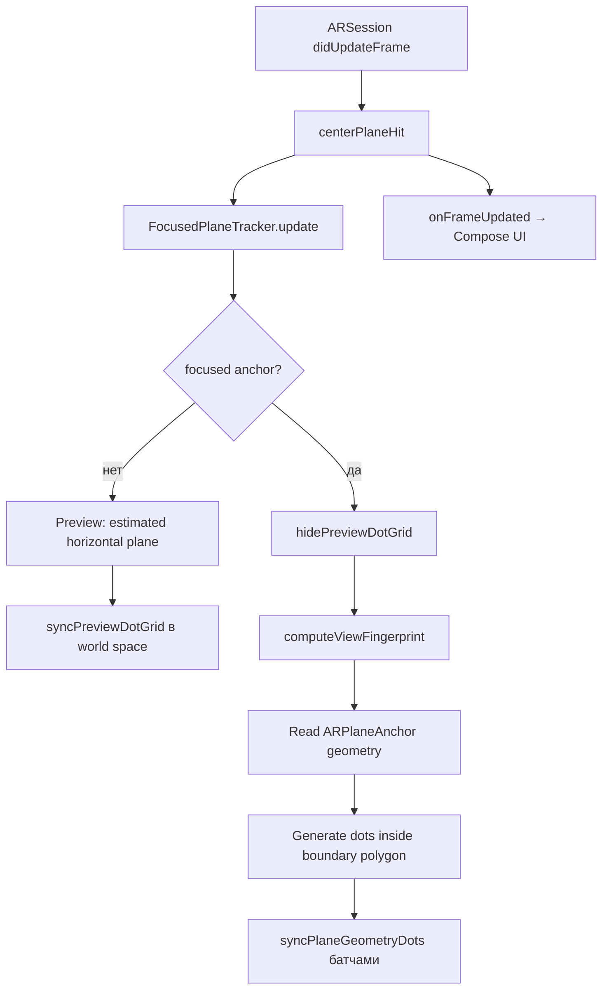
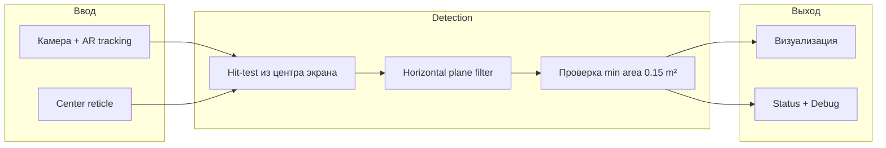

# Обнаружение горизонтальных поверхностей (Android и iOS)

Документ описывает, как приложение **AR Plitka** находит пол и другие горизонтальные поверхности, как отображает их пользователю и чем отличаются реализации на Android (ARCore) и iOS (ARKit).

## Цель UX

Пользователь ходит по комнате с камерой и видит **белые круглые точки в 3D на поверхности** — это preview будущей разметки контура. Поверхность должна:

- обнаруживаться **динамически** при движении;
- быть **горизонтальной** (пол, стол, кровать сверху);
- **фокусироваться** на той плоскости, куда направлен прицел (center reticle);
- давать понятный статус: «ищем», «найдено», площадь, center hit.

---

## Общие понятия

| Понятие | Описание |
|--------|----------|
| **Horizontal plane** | Горизонтальная плоскость, которую строит AR-движок (пол, стол и т.д.) |
| **Center reticle** | Перекрестие в центре экрана; по нему определяется «активная» поверхность |
| **Center hit** | Raycast из центра экрана попал в отслеживаемую горизонтальную плоскость |
| **Selected / focused plane** | Плоскость под прицелом — по ней считается площадь и статус «обнаружено» |
| **MIN_FLOOR_AREA_M2** | Минимальная площадь **0.15 m²**, чтобы считать поверхность пригодной |

Общий UI-kit (`shared/ui/kit`): `CenterReticle`, `StatusPanel`, `DebugPanel` — используется на обеих платформах.

---

## Android (ARCore)

### Стек

- **ARCore** + **SceneView** (`ARSceneView`)
- Модуль: `features/floor-detection`
- Общая логика hit-test: `shared/ar/core/ArExtensions.kt`

### Конфигурация AR-сессии

Файл: `ArSceneLayer.kt`

```kotlin
config.planeFindingMode = Config.PlaneFindingMode.HORIZONTAL
config.lightEstimationMode = Config.LightEstimationMode.ENVIRONMENTAL_HDR
config.depthMode = Config.DepthMode.AUTOMATIC  // если поддерживается
config.focusMode = Config.FocusMode.AUTO
config.updateMode = Config.UpdateMode.LATEST_CAMERA_IMAGE
planeRenderer = !uiState.isFinalized  // нативная отрисовка плоскостей ARCore
```

ARCore сам создаёт и обновляет `Plane` trackables. Визуализация плоскостей — встроенный **plane renderer** SceneView (сетка/полупрозрачная плоскость от ARCore).

### Поток данных (каждый кадр)



### Как определяется center hit

Файл: `shared/ar/core/ArExtensions.kt`

1. Raycast из **центра viewport** (`width/2`, `height/2`).
2. Перебор результатов `frame.hitTest(...)`.
3. Берётся первый hit, где:
   - trackable — `Plane`;
   - `plane.isUsableHorizontalPlane()` — тип `HORIZONTAL_UPWARD_FACING` и `TrackingState.TRACKING`;
   - **`plane.isPoseInPolygon(hit.hitPose)`** — попадание внутри реального полигона плоскости (важно для границ).

### Как определяется «поверхность обнаружена»

Файл: `FloorDetectorRepositoryImpl.kt`

```kotlin
val selectedPlane = (centerHit?.trackable as? Plane)?.takeIf { plane ->
    plane.isUsableHorizontalPlane() && plane.area() >= MIN_FLOOR_AREA_M2
}
isFloorDetected = selectedPlane != null
selectedArea = selectedPlane?.area()  // extentX * extentZ
hasCenterHit = centerHit != null
```

- **Площадь** — из геометрии ARCore (`extentX × extentZ`), не из наших точек.
- Если center hit есть, но площадь < 0.15 m² — статус «ищем».
- Если center hit нет — `hasCenterHit = false`, reticle неактивен.

### UI-состояния

`FloorArViewModel` переводит `ArFrameResult` в `FloorUiState`:

| Условие | status | instruction |
|---------|--------|-------------|
| `trackingState != TRACKING` | `TRACKING_LOST` | `MOVE_PHONE` |
| TRACKING, нет floor | `SEARCHING_FLOOR` | `SEARCHING` |
| TRACKING, floor найден | `FLOOR_DETECTED` | `DETECTED` |

Debug (только `BuildConfig.DEBUG`): Planes, Area, Tracking, Points, Closed, Finalized.

### Отличительные черты Android

- **Визуализация плоскостей** — нативный `planeRenderer` ARCore (все видимые horizontal planes).
- **Логика выбора** — только plane **под прицелом** с проверкой `isPoseInPolygon`.
- **Границы** — ARCore даёт полигон плоскости; hit вне полигона не считается.
- Дальше пользователь ставит **контурные точки** (anchors) — это уже этап после detection.

### Ключевые файлы

| Файл | Роль |
|------|------|
| `ArSceneLayer.kt` | AR-сессия, plane renderer |
| `FloorDetectorRepositoryImpl.kt` | Обработка кадра, selected plane |
| `ArExtensions.kt` | `isUsableHorizontalPlane`, `centerPlaneHit`, `area()` |
| `FloorArViewModel.kt` | UI state machine |
| `FloorArScreen.kt` | Compose UI |

---

## iOS (ARKit)

### Стек

- **ARKit** + **SceneKit** (`ARSCNView`)
- Kotlin/Native: `iosApp/src/iosMain/.../IosArScreen.ios.kt`, `IosArPlaneRenderer.kt`
- ObjC cinterop bridge: `PlaneGeometryBridge.h` + `plane_geometry_bridge.def`

### Конфигурация AR-сессии

```kotlin
ARWorldTrackingConfiguration().apply {
    planeDetection = ARPlaneDetectionHorizontal
}
```

Только горизонтальные `ARPlaneAnchor`. Точки рисуем **сами** — белые плоские диски (`SCNCylinder`) на anchor node (нет аналога plane renderer как на Android).

### Поток данных (каждый кадр)



### Discovery: как читаем поверхность

Основной источник preview-точек — геометрия `ARPlaneAnchor`, а не screen-space hit-grid.

Для focused anchor:

1. ObjC bridge читает `ARPlaneAnchor.geometry.boundaryVertices`.
2. Если boundary недоступен, используем fallback по `anchor.extent`.
3. Строим polygon в local X/Z координатах anchor.
4. Генерируем регулярные точки внутри polygon с шагом `GRID_STEP_M`.
5. Ограничиваем видимость радиусом `VISIBLE_DOT_RADIUS_M` от center hit, чтобы не показывать всю дальнюю комнату.

Center hit всё ещё используется для выбора focused plane и точки центра видимого радиуса.

### Preview: быстрая реакция до готовности polygon

Пока ARKit ещё не дал подтверждённый `ARPlaneAnchor` с polygon geometry, но пользователь уже наводит прицел на пол:

1. Выполняется второй hit-test: `ARHitTestResultTypeEstimatedHorizontalPlane`.
2. Берётся `ARHitTestResult` с transform estimated plane.
3. Preview-grid ставится **в plane-local space** по `worldTransform` hit-test (та же ориентация и высота, что у пола).
4. Рисуется одна точка под прицелом с теми же параметрами, что основная сетка: `FLOOR_DOT_RADIUS_M`, `GRID_STEP_M`.

Когда появляется confirmed center hit и focused anchor — preview скрывается, показывается точная polygon-сетка на anchor node.

### Display: что видит пользователь

**Discovery и display разделены:**

- **Читаем геометрию** всех актуальных `ARPlaneAnchor` из текущего кадра.
- **Показываем** только focused plane — ту, куда попал center hit.

`FocusedPlaneTracker`:

- фокус переключается **сразу** при center hit на другом anchor;
- если прицел ушёл с плоскости — **grace 12 кадров** (~0.2 с), потом фокус сбрасывается.

Отрисовка:

- `computeViewFingerprint` — дешёвая проверка до генерации точек; если fingerprint не изменился, geometry не пересчитывается;
- `syncPlaneGeometryDots` — обновляет grid только при изменении geometry fingerprint/focus;
- первая большая сетка добавляется **батчами** (`DOT_SYNC_BATCH_SIZE = 128`) без freeze UI;
- shared `SCNCylinder` geometry переиспользуется между dots;
- существующие dot-ноды **переиспользуются** (позиция/hidden), а не пересоздаются каждый кадр;
- `hidePlaneDotGrid` — скрывает grid на неактивных anchors (не удаляет — быстрое переключение).

Параметры точек:

- геометрия: плоский диск `SCNCylinder`, радиус **0.013 m**, высота **0.001 m**;
- нижний край диска: **0.003 m** над plane (`GRID_VISUAL_OFFSET_M`).

### Center hit и статус

Center hit — raycast в центр экрана:

1. `ExistingPlaneUsingExtent` → horizontal anchor + local point;
2. `confirmed` = hit внутри boundary polygon (`containsLocalPoint`);
3. если не confirmed — fallback на `EstimatedHorizontalPlane` для preview.

```kotlin
floorDetected = focusedAnchorId != null && selectedArea >= MIN_FLOOR_AREA_M2
selectedArea = geometry.area  // площадь boundary polygon
hasCenterHit = centerHit.confirmed || centerHit.previewHitResult != null
```

**Площадь на iOS** — площадь boundary polygon. Если boundary geometry недоступна, bridge использует fallback по extent.

### UI-состояния

Аналог Android через `ArTrackingStatus` / `ArInstruction`:

| status | Текст |
|--------|-------|
| `SEARCHING_FLOOR` | «Наведите прицел на поверхность» |
| `FLOOR_DETECTED` | «Поверхность под прицелом» |

Debug: Planes, **Focused** (число точек), Area, Tracking, Center hit. На iOS debug-панель показывается **всегда** (на Android — только в `BuildConfig.DEBUG`).

### Отличительные черты iOS

- **Своя 3D-визуализация** — плоские `SCNCylinder`-диски, привязка к `ARPlaneAnchor` node.
- **Preview mode** — estimated plane даёт мгновенный feedback до polygon geometry.
- **Focus mode** — одна видимая плоскость под прицелом; остальные скрыты.
- **Geometry-based renderer** — точки строятся внутри boundary polygon, ближе к Android `planeRenderer`.
- **Видимый радиус** — точки дальше `VISIBLE_DOT_RADIUS_M` от прицела не показываются.

### Ключевые файлы

| Файл | Роль |
|------|------|
| `IosArScreen.ios.kt` | Сессия, coordinator, UI, center hit |
| `IosArPlaneRenderer.kt` | Geometry reader, polygon dot generation, focus, SCN dots |
| `PlaneGeometryBridge.h` | C API для ARKit geometry |
| `plane_geometry_bridge.def` | ObjC реализация и Kotlin cinterop |

---

## Сравнение Android vs iOS

| Аспект | Android (ARCore) | iOS (ARKit) |
|--------|------------------|-------------|
| AR API | ARCore `Plane` | `ARPlaneAnchor` |
| Визуализация | Нативный `planeRenderer` | Плоские `SCNCylinder` dots по polygon + preview |
| Выбор поверхности | Center hit + `isPoseInPolygon` | Center hit + `FocusedPlaneTracker` |
| Что видно | Все planes (renderer) + логика по center | Preview под прицелом, затем только **focused** plane dots |
| Площадь | `extentX × extentZ` от ARCore | Boundary polygon / fallback extent |
| Границы plane | Полигон ARCore | `ARPlaneGeometry.boundaryVertices` / fallback extent |
| Horizontal filter | `HORIZONTAL_UPWARD_FACING` | `ARPlaneAnchorAlignmentHorizontal` |
| Min area | 0.15 m² | 0.15 m² |
| Depth | Automatic, если есть | Не используется в detection |

---

## Диаграмма: общая логика «под прицелом»



---

## Известные ограничения

### Обе платформы

- AR **не знает про стены** на уровне «комнаты» — horizontal plane может логически продолжаться за преградами, пока движок не разделит anchor.
- Качество зависит от освещения, текстуры пола, скорости движения камеры.

### Android

- `planeRenderer` показывает **все** detected planes — может быть шумно при нескольких horizontal surfaces (пол + стол).
- Выбор для бизнес-логики всё равно по center hit.

### iOS

- Основной путь читает `ARPlaneAnchor.geometry.boundaryVertices` через ObjC cinterop bridge, потому что прямые K/N bindings для `Vector128`/SIMD-полей нестабильны.
- Точки могут появляться **за стеной**, если сам ARKit продлил plane anchor, но polygon boundary и видимый радиус уменьшают этот эффект.
- **Будущее улучшение**: один `SCNGeometry` mesh для точек вместо множества cylinder nodes или depth-based culling.

---

## Сборка и тест

### Android

Реальное устройство с ARCore. Экран: `FloorArScreen` → модуль `floor-detection`.

### iOS

```bash
./gradlew :iosApp:linkDebugFrameworkIosArm64
```

Запуск через Xcode на **реальном iPhone** (AR не работает в симуляторе). Экран: `IosArScreen`.

### На что смотреть при проверке

1. Медленно водить камерой по полу — preview появляется сразу, точная polygon-сетка подтягивается следом.
2. Center reticle загорается при hit внутри polygon под прицелом.
3. Перевести прицел на другую horizontal surface (стол, кровать) — iOS переключает focused dots.
4. Debug: Planes > 0, Area ≥ 0.15 → status «обнаружено».
5. Угол у plinth / edge bed — сравнить Android и iOS в одной комнате.

---

## Константы (текущие)

### iOS (`IosArPlaneRenderer.kt`)

| Константа | Значение |
|-----------|----------|
| `VISIBLE_DOT_RADIUS_M` | 2.5 m |
| `GRID_STEP_M` | 0.14 m |
| `FOCUS_GRACE_FRAMES` | 12 |
| `MIN_FLOOR_AREA_M2` | 0.15 m² |
| `FLOOR_DOT_RADIUS_M` | 0.013 m |
| `FLOOR_DOT_HEIGHT_M` | 0.001 m |
| `GRID_VISUAL_OFFSET_M` | 0.003 m |
| `DOT_SYNC_BATCH_SIZE` | 128 |
| `CENTER_FINGERPRINT_STEP_M` | 0.3 m |

### Android

| Константа | Значение |
|-----------|----------|
| `MIN_FLOOR_AREA_M2` | 0.15 m² (`FloorDetectorRepositoryImpl`) |
| `planeFindingMode` | `HORIZONTAL` |

---

## Связанные документы

- `features/floor-detection/README.md` — структура feature-модуля Android
- `shared/ui/kit/README.md` — общие AR UI-компоненты
- `docs/BACKEND_MOCKING_PLAN.md` — AR остаётся platform-specific при KMP
