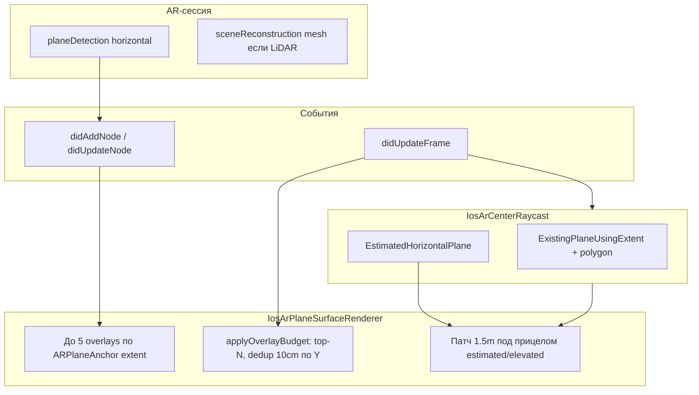
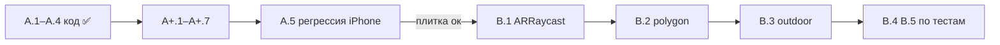

# iOS: поиск и отображение поверхностей — стратегия и план

> Исторический strategy/task-док по этапам iOS surface work. Канонический контракт surface detection находится в [`AR/SURFACE_DETECTION.md`](../../ar/PLATFORM_SURFACE_DETECTION.md), общий parity policy — в [`AR/PLATFORM_PARITY.md`](../../ar/PLATFORM_PARITY.md).

Документ фиксирует обсуждение (июнь 2026): цель продукта, отличия iOS от Android, причины outdoor-проблем, что доступно в современном ARKit vs что используем в коде, и **план действий** (фазы A–B).

Связанные документы:
- [SURFACE_DETECTION.md](./SURFACE_DETECTION.md) — техническая реализация Android/iOS, константы, чеклисты
- [ARCHITECTURE.md](./ARCHITECTURE.md) — общая архитектура KMP
- [IOS_AR_CONTINUOUS_FLOOR_PLACEMENT_PLAN.md](./IOS_AR_CONTINUOUS_FLOOR_PLACEMENT_PLAN.md) — placement mode: continuous floor + explore patch
- [ios-ar-point-stability.md](./ios-ar-point-stability.md) — **стабильность точек контура**, anchor-коррекции, кнопка «Выровнять»
- [SURFACE_DETECTION.md § iOS Debug Panel](./SURFACE_DETECTION.md#ios-debug-panel--справочник-полей) — расшифровка полей debug-панели на устройстве

**Вне scope этого плана:** окклюзия плитки за объектами (машина и т.д.) — далёкое будущее, не проектируем и не закладываем в код.

---

## 1. Цель продукта (зафиксировано)

| Сейчас (фокус) | Позже (не в этом плане) |
|----------------|-------------------------|
| Пользователь **выделяет зону** на **горизонтальном участке** и **меряет/кладёт плитку** | Окклюзия: плитка скрывается за реальными объектами |
| Участок может быть **любым горизонтальным** — плитка, бетон, трава, двор (с разным качеством AR) | |
| Плитка **сквозь объекты видна** — **это ок** на текущем этапе | |

**Текущий этап работ:** только **поиск и отображение** горизонтальной зоны на iOS. Постановка точек контура и плитка — отдельный этап, не блокирует surface-стратегию, но не является предметом этого плана.

---

## 2. Что ищет приложение технически

Продуктово говорим «пол / поверхность», технически:

- AR-сессия: `planeDetection = horizontal` ([ARKit](https://developer.apple.com/documentation/arkit))
- Приложение фильтрует **горизонтальные plane** от ARKit, не классифицирует «трава / асфальт / пол комнаты»
- Нет ML «это земля» — только геометрия трекинга + наши пороги (area, высота, budget overlays)

**Два слоя на iOS (не путать):**

| Слой | Вопрос | Строгость |
|------|--------|-----------|
| **Scan viz** | «Что рисовать?» | Мягче: overlays по anchor + estimated patch 1.5 m; **не** равно статусу «обнаружено» |
| **Статус «обнаружено»** | «Можно работать с зоной?» | **Как Android** (фаза A.2): только **confirmed** + area ≥ 0.15 m² **под прицелом** |

**Договорённость (июнь 2026, по скринам тестировщиков):** scan-viz может показывать крупные planes **вне прицела** (как Android `planeRenderer`), но баннер «обнаружено» — только при confirmed hit под прицелом.

---

## 3. Android vs iOS (2026)

| Аспект | Android (эталон, проблем нет) | iOS (проблемы outdoor) |
|--------|-------------------------------|-------------------------|
| SDK | ARCore **1.50** в проекте; актуально **1.54** ([releases](https://github.com/google-ar/arcore-android-sdk/releases)) | ARKit в составе **iOS 18 SDK**; отдельного `arkit:6` нет — [ARKit 6](https://developer.apple.com/augmented-reality/arkit/) = набор фич в OS |
| Визуал plane | `planeRenderer = true` в SceneView — **нативно** | **Нет** готового renderer; свой `IosArPlaneSurfaceRenderer` |
| Preview | ARCore показывает tracked planes | `EstimatedHorizontalPlane` + **мы рисуем** патч/overlay |
| «Обнаружено» | Confirmed + polygon + area ≥ 0.15 m² | Overlay **или** preview **или** area — **расхождение** |
| LiDAR mesh | Depth API (слабее mesh) | Scene Reconstruction — **включён в конфиге**, **не используется** для scan |
| Outdoor | Средне | Слабее на траве; фантомы от estimated |

**Вывод:** iOS на **современной платформе** (deployment **18.0**), но в коде — **узкий срез API** (`hitTest`, extent box). Это не «старый ARKit», а **недоиспользование** доступного ARKit.

---

## 4. Как работает iOS сейчас (кратко)

Ключевые файлы:

| Файл | Роль |
|------|------|
| `IosArSessionConfiguration.kt` | horizontal planes + optional LiDAR mesh |
| `IosArCenterRaycast.kt` | center hit: confirmed + estimated |
| `IosArPlaneSurfaceRenderer.kt` | overlays + reticle patch |
| `IosArScreen.ios.kt` | coordinator, sync, статус в `FloorArController` |
| `plane_geometry_bridge.def` | extent, polygon helpers, grid texture |

---

## 5. Outdoor-фидбек тестировщиков — почему так

### 5.1 Плоскости «в воздухе»

- ARKit строит **математические** horizontal plane из feature points, не «видит» поверхность как лидар-скан
- До стабильного anchor — **EstimatedHorizontalPlane** (гипотеза)
- На улице (небо, блики, слабый трекинг) гипотеза часто **не на земле**
- Мы **рисуем** estimated как уверенную сетку (патч 1.5 m) → пользователь видит «фантом»
- Это не отдельный баг preview-слоя — это **модель ARKit + агрессивный наш визуал**

### 5.2 Плитка ок, трава плохо

| Среда | Почему |
|-------|--------|
| Плитка, бетон | Плоско, контрастная текстура → стабильные plane |
| Трава | Неровно, однотонно, движется → мало стабильных points → plane «плывёт» или нет |

Plane API **базовый** для горизонтальных поверхностей, но **не универсальный** для любой среды. Альтернативы (mesh/depth raycast) — фаза B, не замена plane на плитке.

### 5.3 Патч 1.5 m

- **Один** квадрат под прицелом, не плитка по всей зоне 2.3×1 m
- Полную зону покрывают **anchor overlays** (до **3**), когда ARKit нашёл plane
- Фиксированный размер — компромисс скорость vs точная граница; **менять не планируем** (июнь 2026)

### 5.4 Dedup по высоте и перекрытие planes

- `SAME_LEVEL_Y_DELTA_M = 0.10` — на одной высоте рисуем только **самую большую** plane
- ARKit может держать **несколько перекрывающихся** `ARPlaneAnchor` на одном физическом полу — приложение **не сливает** якоря (в отличие от ARCore subsuming), только скрывает мелкие в визуале
- Hit / постановка точек — всегда plane **под прицелом**, не «самая большая в сцене»
- **8–10 cm — ок**, менять не планируем

### 5.4.1 Высота сетки (elevation lock)

- Surface grid: геометрия в **local y = 0**, без `GRID_VISUAL_OFFSET_M`
- `applyOverlayElevation` + `PlaneDotElevationLock` — фиксирует **минимальную** виденную высоту пола per anchor (ARKit поднимает anchor при refine)
- Reticle patch: transform из raycast, position `(0,0,0)`

### 5.5 Регрессия по скринам тестировщиков (июнь 2026)

Три сценария на реальном iPhone vs Android (эталон). Маркеры: **iOS — сетка**, **Android — точки**.

#### Сценарий 1: плитка на улице (светло)

| | iOS (скрин) | Android (скрин) |
|---|-------------|-----------------|
| Статус | «Поверхность под прицелом» | «Пол обнаружен» |
| Planes | 22 | 16 |
| Area | 74.58 m² | 66.23 m² |
| Overlays | **3** (`multi/3`) | все planes через `planeRenderer` |
| Проблема | Сетка **на ступеньках**; узкое покрытие vs Android | — |

**Диагноз:** статус (фаза A) **ок**; визуал **слабее** — extent box, budget 5→3 на экране, ARKit фрагментирует plane, ступени попадают в top-N.

#### Сценарий 2: трава

| | iOS | Android |
|---|-----|---------|
| Статус | «Наведите прицел…» | «Пол обнаружен» |
| Planes | 25 | 21 |
| Area | **0.0 m²** | **154.37 m²** |
| Center hit | **No** | точки по всей траве |
| Overlays | 4 | все planes |

**Диагноз:** ARKit дробит траву; под прицелом нет confirmed ≥ 0.15 m² → статус «ищем» **корректен**. Android даёт плотный `planeRenderer` + center hit на крупном plane. iOS: overlays есть, но **недостаточная scan-обратная связь** и нет hit под прицелом.

#### Сценарий 3: лестница после улицы (одна сессия, без выхода из AR)

| | iOS (скрин) |
|---|-------------|
| Сцена | Деревянная лестница внутри |
| Planes | **29** (уличные + домашние) |
| Overlays | 5, сетки **в воздухе** (призраки с плитки) |
| Area | 0.0 m², Center hit: No |
| Focused | `multi/5 (hold)` |

**Диагноз:** **не норма для UX**. ARKit **не удаляет** старые `ARPlaneAnchor` при смене физической локации в одной сессии; relocalization сдвигает мир — уличные anchors остаются в старых координатах → сетки в воздухе. Reset сессии только при **новом** `attach()` (вход в экран), не при ходьбе улица→дом.

---

## 6. Современный ARKit: доступно vs используем

| Возможность | В SDK (iOS 18) | В нашем коде |
|-------------|----------------|--------------|
| Horizontal plane detection | ✅ | ✅ |
| Scene reconstruction (LiDAR mesh) | ✅ | Включено, **не для scan** |
| `ARRaycast` | ✅ | ✅ `pg_center_raycast` bridge |
| `ARSCNPlaneGeometry` (polygon viz) | ✅ | ✅ `pg_create_polygon_grid_line_geometry` |
| Depth API | ✅ на LiDAR | ❌ |
| Plane classification (floor/table) | ✅ на части устройств | ❌ |
| Готовый `planeRenderer` как ARCore | ❌ | — (свой renderer) |

Ссылки: [документация ARKit](https://developer.apple.com/documentation/arkit), [обзор ARKit](https://developer.apple.com/augmented-reality/arkit/).

---

## 7. Фазы работ (без окклюзии)

| Фаза | Цель | Статус |
|------|------|--------|
| **A** | Честный статус, фильтры estimated, overlay budget | ✅ код |
| **A+** | Фиксы по скринам: призраки сессии, scan-viz, ступени, debug | ✅ код (июнь 2026) |
| **B0** | Outdoor UX: локальный preview, патч при поиске, контраст, тексты | ✅ код (июнь 2026) |
| **A.5** | Регрессия на iPhone по чеклисту скринов | ⏳ после B0 |
| **B** | Polygon, ARRaycast, outdoor mode, трава/LiDAR | 📋 после A+ |

---

## 8. Итоговый план действий (по всем скринам)

### Фаза A — **реализовано в коде** (июнь 2026)

| # | Задача | Статус | Файлы |
|---|--------|--------|-------|
| A.1 | **Фильтры estimated patch**: `trackingState == Normal`; hit ниже горизонта камеры; max distance 5 m | ✅ | `IosArPlaneSurfaceRenderer.kt`, `IosArCenterRaycast.kt` |
| A.2 | **«Обнаружено» как Android**: `isFloorDetected` / `hasCenterHit` — только **confirmed** + area ≥ 0.15 m² **под прицелом** | ✅ | `IosArScreen.ios.kt` |
| A.3 | **Overlay budget**: min area **0.15 m²**; plane вне коридора Y относительно камеры (±0.25 m / −3.5 m) | ✅ | `IosArPlaneSurfaceRenderer.kt` |
| A.4 | **Debug**: `Detect gate`, `Scan patch`, hit path `c:yes/no/p:est/no` | ✅ | `IosArScreen.ios.kt`, `IosArCenterRaycast.kt` |

---

### Фаза A+ — фиксы по скринам (**реализовано**, июнь 2026)

| # | Задача | Статус | Файлы |
|---|--------|--------|-------|
| **A+.1** | Relocation reset: `relocalizing`, `sessionWasInterrupted`, fallback `distant-planes` | ✅ | `IosArSessionRelocation.kt`, `IosArScreen.ios.kt` |
| **A+.2** | Distance cull: overlay > **10 m** от камеры | ✅ | `IosArPlaneSurfaceRenderer.kt` |
| **A+.3** | Сброс sticky floor при Y > **1.0 m** | ✅ | `IosArPlaneSurfaceRenderer.kt` |
| **A+.4** | Suppress elevated: Y > floor + **15 cm**, area < floor | ✅ | `IosArPlaneSurfaceRenderer.kt` |
| **A+.5** | Scan feedback: крупнейшая plane всегда в budget | ✅ | `IosArPlaneSurfaceRenderer.kt` |
| **A+.6** | Кнопка **«Пересканировать»** в scan mode | ✅ | `IosArScreen.ios.kt` |
| **A+.7** | Debug: `Largest plane`, `Reloc`, `Cull` | ✅ | `IosArScreen.ios.kt` |

**Не делаем в A+:** смена патча 1.5 m, dedup 10 cm, ослабление gate «обнаружено» на траве.

---

### Фаза B0 — outdoor scan UX (**реализовано**, июнь 2026)

| # | Задача | Статус | Файлы |
|---|--------|--------|-------|
| **B0.1** | ~~Локальный preview 8×8 m~~ → **заменён B.2** полным polygon overlay | ✅ superseded | `IosArPlaneSurfaceRenderer.kt` |
| **B0.2** | Патч 1.5 m под прицелом при `Largest ≥ 0.15` и `Center hit: No` (`search-on`) | ✅ | `IosArPlaneSurfaceRenderer.kt` |
| **B0.3** | Grid: **world-space линии** (1.5 cm), белый solid, без заливки ячеек | ✅ | `pg_create_grid_line_geometry`, renderer |
| **B0.4** | `ArInstruction.SURFACE_NEARBY` — «Сетка найдена — наведите прицел на неё» | ✅ | shared + `IosArScreen.ios.kt` |
| **B0.5** | Панель статуса: **Под прицелом** / **Крупнейшая поверхность** | ✅ | `ArStatusPanel.kt`, `IosArScreen.ios.kt` |

Gate «обнаружено» **не ослаблен** — только scan-viz и тексты.

---

### Фаза A.5 — регрессия на устройстве (после B0)

| # | Сценарий (скрин) | Ожидание |
|---|------------------|----------|
| 1 | **Плитка на улице** | `scan-multi-surface`, area ≥ 0.15 под прицелом, статус «обнаружено»; **нет** сетки на ступенях при скане плитки |
| 2 | **Трава** | Статус «ищем» пока нет confirmed под прицелом; **видна** сетка крупнейшего plane (scan feedback); нет патча в небе |
| 3 | **Улица → лестница** (одна сессия) | Нет сеток в воздухе; planes count падает после reset/cull; только лестница/текущая сцена |
| 4 | Прицел в небо | Нет патча в воздухе; статус «ищем» |
| 5 | Несколько plane на одном уровне | Dedup 10 cm — одна сетка на уровне |
| 6 | Выход из AR → вход снова | Полный reset, нет призраков с прошлой локации |
| 7 | Debug | `Largest plane` ≠ 0 при overlays; `Reloc` при смене места |

---

### Фаза B — после стабилизации A+

| # | Скрин | Задача | Файлы | Эффект |
|---|-------|--------|-------|--------|
| B.1 | Трава, плитка | **ObjC bridge: `ARRaycast`** вместо legacy `hitTest` | bridge + `IosArCenterRaycast.kt` | ✅ Стабильнее center hit |
| B.2 | Плитка, ступени | **Polygon viz** (`pg_create_polygon_grid_line_geometry`) | bridge + `IosArPlaneSurfaceRenderer.kt` | ✅ Сетка по реальной границе; убран B0 8×8 preview |
| B.3 | Улица | **Outdoor mode**: при слабом tracking — только polygon overlays, без estimated patch | `IosArScreen`, renderer | ✅ |
| B.4 | Ступени, столы | **Plane classification**: приоритет floor, suppress table/seat/elevated | bridge + renderer | ✅ |
| B.5 | Трава (LiDAR) | **Пилот mesh-raycast** под прицелом (только если нет stable plane) | bridge + `IosArCenterRaycast.kt` | ✅ |

**Не делаем в B:** окклюзия, скрытие плитки за машиной, depth occlusion pass.

---

### Порядок выполнения

**Приоритет A+ (что делать первым):**

1. **A+.1 + A+.2** — призраки сессии (лестница после улицы) — **критично**
2. **A+.4** — сетка на ступенях при плитке
3. **A+.5 + A+.7** — трава: scan feedback + debug
4. **A+.3, A+.6** — sticky floor + ручной rescan

---

### Оценка трудозатрат (ориентир)

| Блок | Код | + QA на iPhone |
|------|-----|----------------|
| A.1–A.4 | ✅ сделано | — |
| **A+.1–A+.4** (relocation, cull, elevated) | **0.5–1 день** | 0.5 дня |
| **A+.5–A+.7** (scan feedback, debug, rescan) | **0.5 дня** | 0.5 дня |
| A.5 чеклист скринов | — | **1 день** |
| B.1 bridge ARRaycast | 2–4 дня | 1 день |
| B.2 polygon viz | 2–3 дня | 0.5 дня |
| B.3 outdoor mode | 1–2 дня | 0.5 дня |

---

## 9. Договорённости (зафиксировано, июнь 2026)

| Тема | Решение |
|------|---------|
| **Эталон** | Android — референс detection и UX; iOS подтягиваем, не наоборот |
| **Фокус этапа** | Только **поиск и отображение** поверхности; постановка точек / плитка — отдельно |
| **Scan viz vs статус** | Визуал может показывать крупные planes вне прицела; «обнаружено» — только confirmed ≥ 0.15 m² **под прицелом** |
| **Патч 1.5 m** | Оставляем; один квадрат под прицелом |
| **Dedup 10 cm** | Оставляем (визуальный merge мелкой в крупную на одном уровне) |
| **Elevation lock** | Surface grid привязан к min floor Y per anchor |
| **Grid line width** | **0.015 m** (1.5 cm) |
| **Окклюзия** | Вне scope (фаза C) |
| **Сессия при смене места** | Призраки уличных planes внутри дома — **баг**; нужен relocation reset + distance cull (A+) |
| **Трава** | Статус «ищем» без confirmed hit — **ок**; усиливаем scan-viz, не ослабляем gate |
| **Android** | Не тюним без явной задачи |

---

## 10. Явные non-goals (июнь 2026)

- Окклюзия плитки за объектами (фаза C) — **не планируем**
- Удаление постановки точек / контура — **не требуется**
- Смена патча 1.5 m — **не планируем**
- Ослабление `MIN_FLOOR_AREA_M2` (0.15) на траве — **не планируем**
- Тюнинг Android / ARCore — **не требуется** (эталон ок)
- Обновление ARCore 1.50 → 1.54 — опционально, **не связано с iOS surface**

---

## 11. История решений (хронология surface iOS)

| Период | Решение |
|--------|---------|
| Ранний iOS | Focus-only overlay, estimated carpet |
| Июнь 2026 | Floor + reticle patch 1.5 m; убрали freeze «одна plane» |
| Июнь 2026 | Multi-surface pool (до **3**), incremental on `didAdd`, budget в `didUpdateFrame` |
| Июнь 2026 | **Фаза B (B.1–B.5)** в коде: ARRaycast, polygon grid, outdoor strict, classification, mesh raycast |
| Июнь 2026 | Grid 1.5 cm + `PlaneDotElevationLock` на surface overlays |
| Июнь 2026 | Dedup same level 10 cm; closest estimated hit |
| Июнь 2026 | Outdoor-анализ: фантомы = estimated + слабый трекинг; трава = limit plane API |
| Июнь 2026 | Фаза A в коде: confirmed-only gate, patch filters, overlay budget |
| Июнь 2026 | **Скрины тестировщиков:** плитка, трава, лестница → план **A+** |
| Июнь 2026 | **Фаза A+ в коде:** relocation reset, distance cull, elevated suppress, scan feedback, rescan, debug |
| Июнь 2026 | Зафиксирован план A → A+ → A.5 → B; окклюзия вне scope |

---

*Последнее обновление: июнь 2026 (фазы A+ / B, polygon grid, elevation lock). При изменении surface-поведения обновлять этот файл и [SURFACE_DETECTION.md](./SURFACE_DETECTION.md).*
